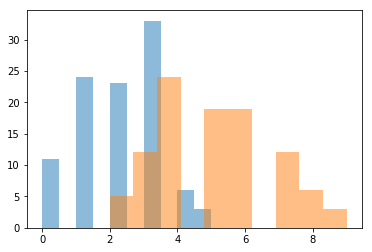
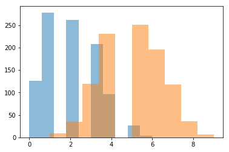
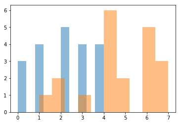
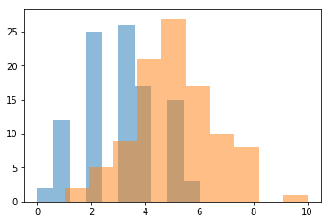
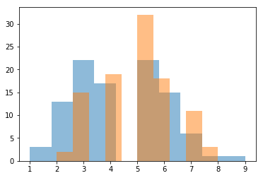
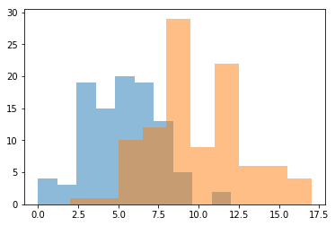

```python
# Ayan Karim DRILL - Exploring the Central Limit Theorem
```


```python
import numpy as np
import pandas as pd
import scipy
import matplotlib.pyplot as plt
%matplotlib inline
```


```python
pop1 = np.random.binomial(10, 0.2, 10000)
pop2 = np.random.binomial(10, 0.5, 10000)
sample1 = np.random.choice(pop1, 100, replace=True)
sample2 = np.random.choice(pop2, 100, replace=True)
print(sample1.mean())
print(sample2.mean())
print(sample1.std())
print(sample2.std())
plt.hist(sample1, alpha=0.5, label='sample 1') 
plt.hist(sample2, alpha=0.5, label='sample 2')
```

    2.08
    5.1
    1.2302845199383758
    1.6881943016134133


    (array([ 5., 12., 24.,  0., 19., 19.,  0., 12.,  6.,  3.]),
     array([2. , 2.7, 3.4, 4.1, 4.8, 5.5, 6.2, 6.9, 7.6, 8.3, 9. ]),
     <a list of 10 Patch objects>)





```python
# 1.

sample1 = np.random.choice(pop1, 1000, replace=True)
sample2 = np.random.choice(pop2, 1000, replace=True)
print(sample1.mean())
print(sample2.mean())
print(sample1.std())
print(sample2.std())
plt.hist(sample1, alpha=0.5, label='sample 1') 
plt.hist(sample2, alpha=0.5, label='sample 2')
```

    1.966
    4.955
    1.2941576410932325
    1.5003249647992931


    (array([  9.,  35., 119., 230.,   0., 251., 196., 118.,  36.,   6.]),
     array([1. , 1.8, 2.6, 3.4, 4.2, 5. , 5.8, 6.6, 7.4, 8.2, 9. ]),
     <a list of 10 Patch objects>)





```python
# What I think will happen: I think the means of both samples will change, 
# sample 1 will have a higher mean and sample 2 will have a lower mean. The standard
# deviations will stay relatively the same.
```


```python
sample1 = np.random.choice(pop1, 20, replace=True)
sample2 = np.random.choice(pop2, 20, replace=True)
print(sample1.mean())
print(sample2.mean())
print(sample1.std())
print(sample2.std())
plt.hist(sample1, alpha=0.5, label='sample 1') 
plt.hist(sample2, alpha=0.5, label='sample 2')
```

    2.1
    4.65
    1.3379088160259651
    1.7109938632268673


    (array([1., 2., 0., 1., 0., 6., 2., 0., 5., 3.]),
     array([1. , 1.6, 2.2, 2.8, 3.4, 4. , 4.6, 5.2, 5.8, 6.4, 7. ]),
     <a list of 10 Patch objects>)





```python
# 2.
pop1 = np.random.binomial(10, 0.3, 10000)
pop2 = np.random.binomial(10, 0.5, 10000)
sample1 = np.random.choice(pop1, 100, replace=True)
sample2 = np.random.choice(pop2, 100, replace=True)
print(sample1.mean())
print(sample2.mean())
print(sample1.std())
print(sample2.std())
plt.hist(sample1, alpha=0.5, label='sample 1') 
plt.hist(sample2, alpha=0.5, label='sample 2')
from scipy.stats import ttest_ind
print(ttest_ind(sample2, sample1, equal_var=False))
```

    3.01
    5.04
    1.3963881981741324
    1.6965848048358796
    Ttest_indResult(statistic=9.1921374964037, pvalue=6.624103285805106e-17)





```python
from scipy.stats import ttest_ind
print(ttest_ind(sample2, sample1, equal_var=False))
```

    Ttest_indResult(statistic=10.29934866505355, pvalue=3.74909249246463e-20)


```python
# What I think will happen: I think the t-value and the p-value will decrease.
```


```python
pop1 = np.random.binomial(10, 0.4, 10000)
pop2 = np.random.binomial(10, 0.5, 10000)
sample1 = np.random.choice(pop1, 100, replace=True)
sample2 = np.random.choice(pop2, 100, replace=True)
print(sample1.mean())
print(sample2.mean())
print(sample1.std())
print(sample2.std())
plt.hist(sample1, alpha=0.5, label='sample 1') 
plt.hist(sample2, alpha=0.5, label='sample 2')
from scipy.stats import ttest_ind
print(ttest_ind(sample2, sample1, equal_var=False))
```

    4.22
    4.94
    1.6527552752903258
    1.362497706420088
    Ttest_indResult(statistic=3.3445553615833217, pvalue=0.0009919448786839802)





```python
# The t-value did decrease a lot, but the pvalue actually increased.
```


```python
# 3.

pop1 = np.random.poisson(5, 10000)
pop2 = np.random.poisson(10, 10000)
sample1 = np.random.choice(pop1, 100, replace=True)
sample2 = np.random.choice(pop2, 100, replace=True)
print(sample1.mean())
print(sample2.mean())
print(sample1.std())
print(sample2.std())
plt.hist(sample1, alpha=0.5, label='sample 1') 
plt.hist(sample2, alpha=0.5, label='sample 2')
from scipy.stats import ttest_ind
print(ttest_ind(sample2, sample1, equal_var=False))
```

    5.2
    9.63
    2.2891046284519194
    2.8342723934018763
    Ttest_indResult(statistic=12.098600609059343, pvalue=2.4260221516623553e-25)





```python
# Yes, the samples means accurately represent the population values
# because the pvalue is very low, so differences in the sample means are
# unlikely caused by noise and more likely caused by actual differences in the population.
```
