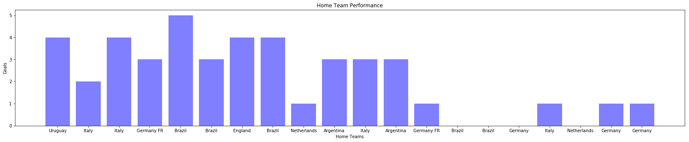
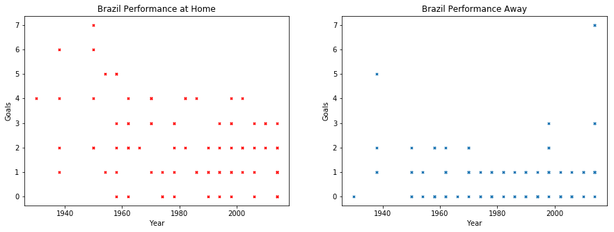

```python
# Ayan Karim 
# Unit 2 Lesson 2 Challenge: "What do you see?"
# Import packages
import numpy as np
import pandas as pd
import matplotlib.pyplot as plt
%matplotlib inline
```


```python
# I used data on the results of Fifa World Cups since 1930
fifadata = pd.read_csv('/Users/ayankarim/Documents/Thinkful Materials/Projects/Unit 2 Lesson 2 Challenge/fifa-world-cup/WorldCupMatches.csv')
print(fifadata)
```

            Year              Datetime              Stage  \
    0     1930.0  13 Jul 1930 - 15:00             Group 1   
    1     1930.0  13 Jul 1930 - 15:00             Group 4   
    2     1930.0  14 Jul 1930 - 12:45             Group 2   
    3     1930.0  14 Jul 1930 - 14:50             Group 3   
    4     1930.0  15 Jul 1930 - 16:00             Group 1   
    5     1930.0  16 Jul 1930 - 14:45             Group 1   
    6     1930.0  17 Jul 1930 - 12:45             Group 2   
    7     1930.0  17 Jul 1930 - 14:45             Group 4   
    8     1930.0  18 Jul 1930 - 14:30             Group 3   
    9     1930.0  19 Jul 1930 - 12:50             Group 1   
    10    1930.0  19 Jul 1930 - 15:00             Group 1   
    11    1930.0  20 Jul 1930 - 13:00             Group 2   
    12    1930.0  20 Jul 1930 - 15:00             Group 4   
    13    1930.0  21 Jul 1930 - 14:50             Group 3   
    14    1930.0  22 Jul 1930 - 14:45             Group 1   
    15    1930.0  26 Jul 1930 - 14:45         Semi-finals   
    16    1930.0  27 Jul 1930 - 14:45         Semi-finals   
    17    1930.0  30 Jul 1930 - 14:15               Final   
    18    1934.0  27 May 1934 - 16:30   Preliminary round   
    19    1934.0  27 May 1934 - 16:30   Preliminary round   
    20    1934.0  27 May 1934 - 16:30   Preliminary round   
    21    1934.0  27 May 1934 - 16:30   Preliminary round   
    22    1934.0  27 May 1934 - 16:30   Preliminary round   
    23    1934.0  27 May 1934 - 16:30   Preliminary round   
    24    1934.0  27 May 1934 - 16:30   Preliminary round   
    25    1934.0  27 May 1934 - 16:30   Preliminary round   
    26    1934.0  31 May 1934 - 16:30      Quarter-finals   
    27    1934.0  31 May 1934 - 16:30      Quarter-finals   
    28    1934.0  31 May 1934 - 16:30      Quarter-finals   
    29    1934.0  31 May 1934 - 16:30      Quarter-finals   
    ...      ...                   ...                ...   
    4542     NaN                   NaN                NaN   
    4543     NaN                   NaN                NaN   
    4544     NaN                   NaN                NaN   
    4545     NaN                   NaN                NaN   
    4546     NaN                   NaN                NaN   
    4547     NaN                   NaN                NaN   
    4548     NaN                   NaN                NaN   
    4549     NaN                   NaN                NaN   
    4550     NaN                   NaN                NaN   
    4551     NaN                   NaN                NaN   
    4552     NaN                   NaN                NaN   
    4553     NaN                   NaN                NaN   
    4554     NaN                   NaN                NaN   
    4555     NaN                   NaN                NaN   
    4556     NaN                   NaN                NaN   
    4557     NaN                   NaN                NaN   
    4558     NaN                   NaN                NaN   
    4559     NaN                   NaN                NaN   
    4560     NaN                   NaN                NaN   
    4561     NaN                   NaN                NaN   
    4562     NaN                   NaN                NaN   
    4563     NaN                   NaN                NaN   
    4564     NaN                   NaN                NaN   
    4565     NaN                   NaN                NaN   
    4566     NaN                   NaN                NaN   
    4567     NaN                   NaN                NaN   
    4568     NaN                   NaN                NaN   
    4569     NaN                   NaN                NaN   
    4570     NaN                   NaN                NaN   
    4571     NaN                   NaN                NaN   
    
                          Stadium         City  Home Team Name  Home Team Goals  \
    0                     Pocitos  Montevideo           France              4.0   
    1              Parque Central  Montevideo              USA              3.0   
    2              Parque Central  Montevideo       Yugoslavia              2.0   
    3                     Pocitos  Montevideo          Romania              3.0   
    4              Parque Central  Montevideo        Argentina              1.0   
    5              Parque Central  Montevideo            Chile              3.0   
    6              Parque Central  Montevideo       Yugoslavia              4.0   
    7              Parque Central  Montevideo              USA              3.0   
    8          Estadio Centenario  Montevideo          Uruguay              1.0   
    9          Estadio Centenario  Montevideo            Chile              1.0   
    10         Estadio Centenario  Montevideo        Argentina              6.0   
    11         Estadio Centenario  Montevideo           Brazil              4.0   
    12         Estadio Centenario  Montevideo         Paraguay              1.0   
    13         Estadio Centenario  Montevideo          Uruguay              4.0   
    14         Estadio Centenario  Montevideo        Argentina              3.0   
    15         Estadio Centenario  Montevideo        Argentina              6.0   
    16         Estadio Centenario  Montevideo          Uruguay              6.0   
    17         Estadio Centenario  Montevideo          Uruguay              4.0   
    18    Stadio Benito Mussolini       Turin          Austria              3.0   
    19          Giorgio Ascarelli      Naples          Hungary              4.0   
    20                   San Siro       Milan      Switzerland              3.0   
    21                  Littorale     Bologna           Sweden              3.0   
    22             Giovanni Berta    Florence          Germany              5.0   
    23             Luigi Ferraris       Genoa            Spain              3.0   
    24              Nazionale PNF        Rome            Italy              7.0   
    25                   Littorio     Trieste   Czechoslovakia              2.0   
    26    Stadio Benito Mussolini       Turin   Czechoslovakia              3.0   
    27                   San Siro       Milan          Germany              2.0   
    28             Giovanni Berta    Florence            Italy              1.0   
    29                  Littorale     Bologna          Austria              2.0   
    ...                       ...          ...             ...              ...   
    4542                      NaN          NaN             NaN              NaN   
    4543                      NaN          NaN             NaN              NaN   
    4544                      NaN          NaN             NaN              NaN   
    4545                      NaN          NaN             NaN              NaN   
    4546                      NaN          NaN             NaN              NaN   
    4547                      NaN          NaN             NaN              NaN   
    4548                      NaN          NaN             NaN              NaN   
    4549                      NaN          NaN             NaN              NaN   
    4550                      NaN          NaN             NaN              NaN   
    4551                      NaN          NaN             NaN              NaN   
    4552                      NaN          NaN             NaN              NaN   
    4553                      NaN          NaN             NaN              NaN   
    4554                      NaN          NaN             NaN              NaN   
    4555                      NaN          NaN             NaN              NaN   
    4556                      NaN          NaN             NaN              NaN   
    4557                      NaN          NaN             NaN              NaN   
    4558                      NaN          NaN             NaN              NaN   
    4559                      NaN          NaN             NaN              NaN   
    4560                      NaN          NaN             NaN              NaN   
    4561                      NaN          NaN             NaN              NaN   
    4562                      NaN          NaN             NaN              NaN   
    4563                      NaN          NaN             NaN              NaN   
    4564                      NaN          NaN             NaN              NaN   
    4565                      NaN          NaN             NaN              NaN   
    4566                      NaN          NaN             NaN              NaN   
    4567                      NaN          NaN             NaN              NaN   
    4568                      NaN          NaN             NaN              NaN   
    4569                      NaN          NaN             NaN              NaN   
    4570                      NaN          NaN             NaN              NaN   
    4571                      NaN          NaN             NaN              NaN   
    
          Away Team Goals Away Team Name                 Win conditions  \
    0                 1.0         Mexico                                  
    1                 0.0        Belgium                                  
    2                 1.0         Brazil                                  
    3                 1.0           Peru                                  
    4                 0.0         France                                  
    5                 0.0         Mexico                                  
    6                 0.0        Bolivia                                  
    7                 0.0       Paraguay                                  
    8                 0.0           Peru                                  
    9                 0.0         France                                  
    10                3.0         Mexico                                  
    11                0.0        Bolivia                                  
    12                0.0        Belgium                                  
    13                0.0        Romania                                  
    14                1.0          Chile                                  
    15                1.0            USA                                  
    16                1.0     Yugoslavia                                  
    17                2.0      Argentina                                  
    18                2.0         France  Austria win after extra time    
    19                2.0          Egypt                                  
    20                2.0    Netherlands                                  
    21                2.0      Argentina                                  
    22                2.0        Belgium                                  
    23                1.0         Brazil                                  
    24                1.0            USA                                  
    25                1.0        Romania                                  
    26                2.0    Switzerland                                  
    27                1.0         Sweden                                  
    28                1.0          Spain                                  
    29                1.0        Hungary                                  
    ...               ...            ...                            ...   
    4542              NaN            NaN                            NaN   
    4543              NaN            NaN                            NaN   
    4544              NaN            NaN                            NaN   
    4545              NaN            NaN                            NaN   
    4546              NaN            NaN                            NaN   
    4547              NaN            NaN                            NaN   
    4548              NaN            NaN                            NaN   
    4549              NaN            NaN                            NaN   
    4550              NaN            NaN                            NaN   
    4551              NaN            NaN                            NaN   
    4552              NaN            NaN                            NaN   
    4553              NaN            NaN                            NaN   
    4554              NaN            NaN                            NaN   
    4555              NaN            NaN                            NaN   
    4556              NaN            NaN                            NaN   
    4557              NaN            NaN                            NaN   
    4558              NaN            NaN                            NaN   
    4559              NaN            NaN                            NaN   
    4560              NaN            NaN                            NaN   
    4561              NaN            NaN                            NaN   
    4562              NaN            NaN                            NaN   
    4563              NaN            NaN                            NaN   
    4564              NaN            NaN                            NaN   
    4565              NaN            NaN                            NaN   
    4566              NaN            NaN                            NaN   
    4567              NaN            NaN                            NaN   
    4568              NaN            NaN                            NaN   
    4569              NaN            NaN                            NaN   
    4570              NaN            NaN                            NaN   
    4571              NaN            NaN                            NaN   
    
          Attendance  Half-time Home Goals  Half-time Away Goals  \
    0         4444.0                   3.0                   0.0   
    1        18346.0                   2.0                   0.0   
    2        24059.0                   2.0                   0.0   
    3         2549.0                   1.0                   0.0   
    4        23409.0                   0.0                   0.0   
    5         9249.0                   1.0                   0.0   
    6        18306.0                   0.0                   0.0   
    7        18306.0                   2.0                   0.0   
    8        57735.0                   0.0                   0.0   
    9         2000.0                   0.0                   0.0   
    10       42100.0                   3.0                   1.0   
    11       25466.0                   1.0                   0.0   
    12       12000.0                   1.0                   0.0   
    13       70022.0                   4.0                   0.0   
    14       41459.0                   2.0                   1.0   
    15       72886.0                   1.0                   0.0   
    16       79867.0                   3.0                   1.0   
    17       68346.0                   1.0                   2.0   
    18       16000.0                   0.0                   0.0   
    19        9000.0                   2.0                   2.0   
    20       33000.0                   2.0                   1.0   
    21       14000.0                   1.0                   1.0   
    22        8000.0                   1.0                   2.0   
    23       21000.0                   3.0                   0.0   
    24       25000.0                   3.0                   0.0   
    25        9000.0                   0.0                   1.0   
    26       12000.0                   1.0                   1.0   
    27        3000.0                   0.0                   0.0   
    28       35000.0                   0.0                   0.0   
    29       23000.0                   1.0                   0.0   
    ...          ...                   ...                   ...   
    4542         NaN                   NaN                   NaN   
    4543         NaN                   NaN                   NaN   
    4544         NaN                   NaN                   NaN   
    4545         NaN                   NaN                   NaN   
    4546         NaN                   NaN                   NaN   
    4547         NaN                   NaN                   NaN   
    4548         NaN                   NaN                   NaN   
    4549         NaN                   NaN                   NaN   
    4550         NaN                   NaN                   NaN   
    4551         NaN                   NaN                   NaN   
    4552         NaN                   NaN                   NaN   
    4553         NaN                   NaN                   NaN   
    4554         NaN                   NaN                   NaN   
    4555         NaN                   NaN                   NaN   
    4556         NaN                   NaN                   NaN   
    4557         NaN                   NaN                   NaN   
    4558         NaN                   NaN                   NaN   
    4559         NaN                   NaN                   NaN   
    4560         NaN                   NaN                   NaN   
    4561         NaN                   NaN                   NaN   
    4562         NaN                   NaN                   NaN   
    4563         NaN                   NaN                   NaN   
    4564         NaN                   NaN                   NaN   
    4565         NaN                   NaN                   NaN   
    4566         NaN                   NaN                   NaN   
    4567         NaN                   NaN                   NaN   
    4568         NaN                   NaN                   NaN   
    4569         NaN                   NaN                   NaN   
    4570         NaN                   NaN                   NaN   
    4571         NaN                   NaN                   NaN   
    
                             Referee                 Assistant 1  \
    0         LOMBARDI Domingo (URU)       CRISTOPHE Henry (BEL)   
    1              MACIAS Jose (ARG)    MATEUCCI Francisco (URU)   
    2            TEJADA Anibal (URU)     VALLARINO Ricardo (URU)   
    3          WARNKEN Alberto (CHI)         LANGENUS Jean (BEL)   
    4            REGO Gilberto (BRA)        SAUCEDO Ulises (BOL)   
    5          CRISTOPHE Henry (BEL)     APHESTEGUY Martin (URU)   
    6       MATEUCCI Francisco (URU)      LOMBARDI Domingo (URU)   
    7              MACIAS Jose (ARG)     APHESTEGUY Martin (URU)   
    8            LANGENUS Jean (BEL)         BALWAY Thomas (FRA)   
    9            TEJADA Anibal (URU)      LOMBARDI Domingo (URU)   
    10          SAUCEDO Ulises (BOL)      ALONSO Gualberto (URU)   
    11           BALWAY Thomas (FRA)    MATEUCCI Francisco (URU)   
    12       VALLARINO Ricardo (URU)           MACIAS Jose (ARG)   
    13           REGO Gilberto (BRA)       WARNKEN Alberto (CHI)   
    14           LANGENUS Jean (BEL)       CRISTOPHE Henry (BEL)   
    15           LANGENUS Jean (BEL)        VALLEJO Gaspar (MEX)   
    16           REGO Gilberto (BRA)        SAUCEDO Ulises (BOL)   
    17           LANGENUS Jean (BEL)        SAUCEDO Ulises (BOL)   
    18    VAN MOORSEL Johannes (NED)       CAIRONI Camillo (ITA)   
    19      BARLASSINA Rinaldo (ITA)      DATTILO Generoso (ITA)   
    20             EKLIND Ivan (SWE)         BERANEK Alois (AUT)   
    21             BRAUN Eugen (AUT)        CARRARO Albino (ITA)   
    22        MATTEA Francesco (ITA)  MELANDRI Ermenegildo (ITA)   
    23           BIRLEM Alfred (GER)      CARMINATI Ettore (ITA)   
    24             MERCET Rene (SUI)        ESCARTIN Pedro (ESP)   
    25           LANGENUS Jean (BEL)       SCARPI Giuseppe (ITA)   
    26           BERANEK Alois (AUT)       MOHAMED Youssuf (EGY)   
    27      BARLASSINA Rinaldo (ITA)           MERCET Rene (SUI)   
    28             BAERT Louis (BEL)       ZENISEK Bohumil (TCH)   
    29        MATTEA Francesco (ITA)        ESCARTIN Pedro (ESP)   
    ...                          ...                         ...   
    4542                         NaN                         NaN   
    4543                         NaN                         NaN   
    4544                         NaN                         NaN   
    4545                         NaN                         NaN   
    4546                         NaN                         NaN   
    4547                         NaN                         NaN   
    4548                         NaN                         NaN   
    4549                         NaN                         NaN   
    4550                         NaN                         NaN   
    4551                         NaN                         NaN   
    4552                         NaN                         NaN   
    4553                         NaN                         NaN   
    4554                         NaN                         NaN   
    4555                         NaN                         NaN   
    4556                         NaN                         NaN   
    4557                         NaN                         NaN   
    4558                         NaN                         NaN   
    4559                         NaN                         NaN   
    4560                         NaN                         NaN   
    4561                         NaN                         NaN   
    4562                         NaN                         NaN   
    4563                         NaN                         NaN   
    4564                         NaN                         NaN   
    4565                         NaN                         NaN   
    4566                         NaN                         NaN   
    4567                         NaN                         NaN   
    4568                         NaN                         NaN   
    4569                         NaN                         NaN   
    4570                         NaN                         NaN   
    4571                         NaN                         NaN   
    
                         Assistant 2  RoundID  MatchID Home Team Initials  \
    0            REGO Gilberto (BRA)    201.0   1096.0                FRA   
    1          WARNKEN Alberto (CHI)    201.0   1090.0                USA   
    2            BALWAY Thomas (FRA)    201.0   1093.0                YUG   
    3       MATEUCCI Francisco (URU)    201.0   1098.0                ROU   
    4     RADULESCU Constantin (ROU)    201.0   1085.0                ARG   
    5            LANGENUS Jean (BEL)    201.0   1095.0                CHI   
    6          WARNKEN Alberto (CHI)    201.0   1092.0                YUG   
    7            TEJADA Anibal (URU)    201.0   1097.0                USA   
    8          CRISTOPHE Henry (BEL)    201.0   1099.0                URU   
    9            REGO Gilberto (BRA)    201.0   1094.0                CHI   
    10    RADULESCU Constantin (ROU)    201.0   1086.0                ARG   
    11          VALLEJO Gaspar (MEX)    201.0   1091.0                BRA   
    12        LOMBARDI Domingo (URU)    201.0   1089.0                PAR   
    13          SAUCEDO Ulises (BOL)    201.0   1100.0                URU   
    14          SAUCEDO Ulises (BOL)    201.0   1084.0                ARG   
    15         WARNKEN Alberto (CHI)    202.0   1088.0                ARG   
    16           BALWAY Thomas (FRA)    202.0   1101.0                URU   
    17         CRISTOPHE Henry (BEL)    405.0   1087.0                URU   
    18             BAERT Louis (BEL)    204.0   1104.0                AUT   
    19            SASSI Otello (ITA)    204.0   1119.0                HUN   
    20     BONIVENTO Ferruccio (ITA)    204.0   1133.0                SUI   
    21       TURBIANI Giuseppe (ITA)    204.0   1102.0                SWE   
    22           BAERT Jacques (FRA)    204.0   1108.0                GER   
    23        IVANCSICS Mihaly (HUN)    204.0   1111.0                ESP   
    24         ZENISEK Bohumil (TCH)    204.0   1135.0                ITA   
    25       SCORZONI Raffaele (ITA)    204.0   1141.0                TCH   
    26           BAERT Jacques (FRA)    418.0   1143.0                TCH   
    27    VAN MOORSEL Johannes (NED)    418.0   1129.0                GER   
    28        IVANCSICS Mihaly (HUN)    418.0   1122.0                ITA   
    29           BIRLEM Alfred (GER)    418.0   1106.0                AUT   
    ...                          ...      ...      ...                ...   
    4542                         NaN      NaN      NaN                NaN   
    4543                         NaN      NaN      NaN                NaN   
    4544                         NaN      NaN      NaN                NaN   
    4545                         NaN      NaN      NaN                NaN   
    4546                         NaN      NaN      NaN                NaN   
    4547                         NaN      NaN      NaN                NaN   
    4548                         NaN      NaN      NaN                NaN   
    4549                         NaN      NaN      NaN                NaN   
    4550                         NaN      NaN      NaN                NaN   
    4551                         NaN      NaN      NaN                NaN   
    4552                         NaN      NaN      NaN                NaN   
    4553                         NaN      NaN      NaN                NaN   
    4554                         NaN      NaN      NaN                NaN   
    4555                         NaN      NaN      NaN                NaN   
    4556                         NaN      NaN      NaN                NaN   
    4557                         NaN      NaN      NaN                NaN   
    4558                         NaN      NaN      NaN                NaN   
    4559                         NaN      NaN      NaN                NaN   
    4560                         NaN      NaN      NaN                NaN   
    4561                         NaN      NaN      NaN                NaN   
    4562                         NaN      NaN      NaN                NaN   
    4563                         NaN      NaN      NaN                NaN   
    4564                         NaN      NaN      NaN                NaN   
    4565                         NaN      NaN      NaN                NaN   
    4566                         NaN      NaN      NaN                NaN   
    4567                         NaN      NaN      NaN                NaN   
    4568                         NaN      NaN      NaN                NaN   
    4569                         NaN      NaN      NaN                NaN   
    4570                         NaN      NaN      NaN                NaN   
    4571                         NaN      NaN      NaN                NaN   
    
         Away Team Initials  
    0                   MEX  
    1                   BEL  
    2                   BRA  
    3                   PER  
    4                   FRA  
    5                   MEX  
    6                   BOL  
    7                   PAR  
    8                   PER  
    9                   FRA  
    10                  MEX  
    11                  BOL  
    12                  BEL  
    13                  ROU  
    14                  CHI  
    15                  USA  
    16                  YUG  
    17                  ARG  
    18                  FRA  
    19                  EGY  
    20                  NED  
    21                  ARG  
    22                  BEL  
    23                  BRA  
    24                  USA  
    25                  ROU  
    26                  SUI  
    27                  SWE  
    28                  ESP  
    29                  HUN  
    ...                 ...  
    4542                NaN  
    4543                NaN  
    4544                NaN  
    4545                NaN  
    4546                NaN  
    4547                NaN  
    4548                NaN  
    4549                NaN  
    4550                NaN  
    4551                NaN  
    4552                NaN  
    4553                NaN  
    4554                NaN  
    4555                NaN  
    4556                NaN  
    4557                NaN  
    4558                NaN  
    4559                NaN  
    4560                NaN  
    4561                NaN  
    4562                NaN  
    4563                NaN  
    4564                NaN  
    4565                NaN  
    4566                NaN  
    4567                NaN  
    4568                NaN  
    4569                NaN  
    4570                NaN  
    4571                NaN  
    
    [4572 rows x 20 columns]


```python
# 1. Bar plots of goal scoring ability of each country in the world cup finals
finalsdata = fifadata[fifadata['Stage'] == 'Final']
```


```python
plt.figure(figsize=(28, 5))
x = finalsdata['Home Team Name']
y_pos = np.arange(len(x))
y = finalsdata['Home Team Goals']
plt.bar(y_pos, y, align='center', color='blue', alpha=0.5)
plt.xticks(y_pos, x)
plt.title('Home Team Performance')
plt.xlabel('Home Teams')
plt.ylabel('Goals')

plt.figure(figsize=(28, 5))
a = finalsdata['Away Team Name']
b_pos = np.arange(len(a))
b = finalsdata['Away Team Goals']
plt.bar(b_pos, b, align='center', color='red', alpha=0.5)
plt.xticks(b_pos, a)
plt.title('Away Team Performance')
plt.xlabel('Away Teams')
plt.ylabel('Goals')
plt.ylim([0, 5])
```


    (0, 5)





```python
# For a direct comparison between home team perfomance and away team perfomance, 
# the bar plots are plotted above one another. 
# The y-axis scale for graph 2 was adjusted and the colors are set different to make comparison easier 
# The bar plots above compare the performance of away and home teams during the world cup finals since 1930. 
# These plots seem to show that when teams play at home, they score more goals compared to teams who play away.
# We can see that away teams score no more than 3 goals, where as home teams show evidence of scoring 3 to 5 goals.
```


```python
# 2. Histogram of frequency of goals scored in the finals at home and away
home_goals_finals = finalsdata['Home Team Goals']
away_goals_finals = finalsdata['Away Team Goals']
```


```python
plt.hist(home_goals_finals, density=True, color='blue', alpha=0.5)
plt.hist(away_goals_finals, density=True, color='red', alpha=0.5)
plt.title('Frequency of Goals Scored in Finals')
plt.xlabel('Goals')
```


    Text(0.5,0,'Goals')


```python
# The histogram above shows compares how frequently teams score a certain number of goals 
# in the finals at home and away. In blue, we see that there's a symmetric skew in the number of goals per Final.
# In red, we see that it's positively skewed, showing that higher goal scoring in Finals is less frequent when away.
```


```python
# 3. Scatter Plot of brazil's perfomance over the years
brazildata = fifadata[fifadata['Home Team Name'] == 'Brazil']
```


```python
plt.figure(figsize=(15, 5))

plt.subplot(1, 2, 1)
plt.scatter(x=brazildata['Year'], y=brazildata['Home Team Goals'], color= 'red', marker='x', s=10)
plt.title('Brazil Performance at Home')
plt.xlabel('Year')
plt.ylabel('Goals')


plt.subplot(1, 2, 2)
plt.scatter(x=brazildata['Year'], y=brazildata['Away Team Goals'], marker='x', s=10)
plt.title('Brazil Performance Away')
plt.xlabel('Year')
plt.ylabel('Goals')
```


    Text(0,0.5,'Goals')





```python
# The scatter plots above each compare the goal-scoring of Brazil since 1930. 
# The left shows their performance at home and the right shows performance away.
# We can see that Brazil's goals scoring ability has a slightly downward trend at home since 1930.
# Where as their performance away has remained relatively consistent, despite a couple outliers.
```


```python
# 4. Boxplot of the range of amount of goals scored at home
homegoals = fifadata[fifadata['Home Team Goals'] >= 0.0]
homegoals = homegoals['Home Team Goals']
```


```python
plt.boxplot(homegoals)
```


    {'whiskers': [<matplotlib.lines.Line2D at 0x1124f6978>,
      <matplotlib.lines.Line2D at 0x1124f6e10>],
     'caps': [<matplotlib.lines.Line2D at 0x1124fe240>,
      <matplotlib.lines.Line2D at 0x1124fe668>],
     'boxes': [<matplotlib.lines.Line2D at 0x1124f6828>],
     'medians': [<matplotlib.lines.Line2D at 0x1124fea90>],
     'fliers': [<matplotlib.lines.Line2D at 0x1124feeb8>],
     'means': []}


```python
# The boxplot above shows the range of the frequency of goals scored in home games.
# The range is between 0 and 6 goals witht the median at 2 goals.
# Scoring above 6 goals in world cup games are outliers.
```
