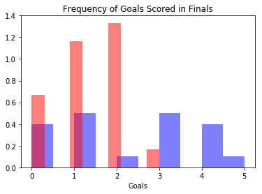
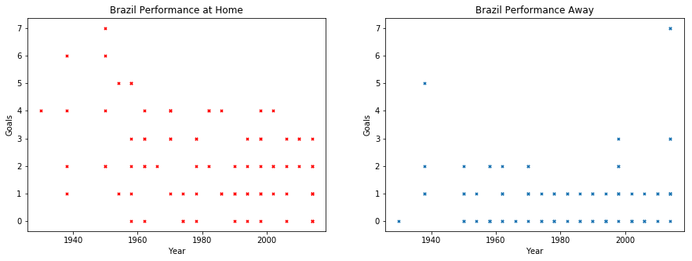
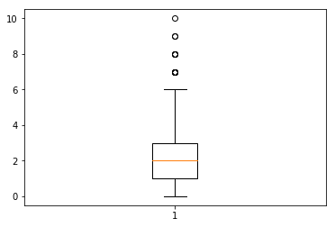

```python
# Ayan Karim 
# Unit 2 Lesson 2 Challenge: "What do you see?"
# Import packages
import numpy as np
import pandas as pd
import matplotlib.pyplot as plt
%matplotlib inline
```


```python
# I used data on the results of Fifa World Cups since 1930
fifadata = pd.read_csv('/Users/ayankarim/Documents/Thinkful Materials/Projects/fifa-world-cup/WorldCupMatches.csv')
print(fifadata)
```

            Year              Datetime              Stage  \
    0     1930.0  13 Jul 1930 - 15:00             Group 1   
    1     1930.0  13 Jul 1930 - 15:00             Group 4   
    2     1930.0  14 Jul 1930 - 12:45             Group 2   
    3     1930.0  14 Jul 1930 - 14:50             Group 3   
    4     1930.0  15 Jul 1930 - 16:00             Group 1   
    5     1930.0  16 Jul 1930 - 14:45             Group 1   
    6     1930.0  17 Jul 1930 - 12:45             Group 2   
    7     1930.0  17 Jul 1930 - 14:45             Group 4   
    8     1930.0  18 Jul 1930 - 14:30             Group 3   
    9     1930.0  19 Jul 1930 - 12:50             Group 1   
    10    1930.0  19 Jul 1930 - 15:00             Group 1   
    11    1930.0  20 Jul 1930 - 13:00             Group 2   
    12    1930.0  20 Jul 1930 - 15:00             Group 4   
    13    1930.0  21 Jul 1930 - 14:50             Group 3   
    14    1930.0  22 Jul 1930 - 14:45             Group 1   
    15    1930.0  26 Jul 1930 - 14:45         Semi-finals   
    16    1930.0  27 Jul 1930 - 14:45         Semi-finals   
    17    1930.0  30 Jul 1930 - 14:15               Final   
    18    1934.0  27 May 1934 - 16:30   Preliminary round   
    19    1934.0  27 May 1934 - 16:30   Preliminary round   
    20    1934.0  27 May 1934 - 16:30   Preliminary round   
    21    1934.0  27 May 1934 - 16:30   Preliminary round   
    22    1934.0  27 May 1934 - 16:30   Preliminary round   
    23    1934.0  27 May 1934 - 16:30   Preliminary round   
    24    1934.0  27 May 1934 - 16:30   Preliminary round   
    25    1934.0  27 May 1934 - 16:30   Preliminary round   
    26    1934.0  31 May 1934 - 16:30      Quarter-finals   
    27    1934.0  31 May 1934 - 16:30      Quarter-finals   
    28    1934.0  31 May 1934 - 16:30      Quarter-finals   
    29    1934.0  31 May 1934 - 16:30      Quarter-finals   
    ...      ...                   ...                ...   
    4542     NaN                   NaN                NaN   
    4543     NaN                   NaN                NaN   
    4544     NaN                   NaN                NaN   
    4545     NaN                   NaN                NaN   
    4546     NaN                   NaN                NaN   
    4547     NaN                   NaN                NaN   
    4548     NaN                   NaN                NaN   
    4549     NaN                   NaN                NaN   
    4550     NaN                   NaN                NaN   
    4551     NaN                   NaN                NaN   
    4552     NaN                   NaN                NaN   
    4553     NaN                   NaN                NaN   
    4554     NaN                   NaN                NaN   
    4555     NaN                   NaN                NaN   
    4556     NaN                   NaN                NaN   
    4557     NaN                   NaN                NaN   
    4558     NaN                   NaN                NaN   
    4559     NaN                   NaN                NaN   
    4560     NaN                   NaN                NaN   
    4561     NaN                   NaN                NaN   
    4562     NaN                   NaN                NaN   
    4563     NaN                   NaN                NaN   
    4564     NaN                   NaN                NaN   
    4565     NaN                   NaN                NaN   
    4566     NaN                   NaN                NaN   
    4567     NaN                   NaN                NaN   
    4568     NaN                   NaN                NaN   
    4569     NaN                   NaN                NaN   
    4570     NaN                   NaN                NaN   
    4571     NaN                   NaN                NaN   
    
                          Stadium         City  Home Team Name  Home Team Goals  \
    0                     Pocitos  Montevideo           France              4.0   
    1              Parque Central  Montevideo              USA              3.0   
    2              Parque Central  Montevideo       Yugoslavia              2.0   
    3                     Pocitos  Montevideo          Romania              3.0   
    4              Parque Central  Montevideo        Argentina              1.0   
    5              Parque Central  Montevideo            Chile              3.0   
    6              Parque Central  Montevideo       Yugoslavia              4.0   
    7              Parque Central  Montevideo              USA              3.0   
    8          Estadio Centenario  Montevideo          Uruguay              1.0   
    9          Estadio Centenario  Montevideo            Chile              1.0   
    10         Estadio Centenario  Montevideo        Argentina              6.0   
    11         Estadio Centenario  Montevideo           Brazil              4.0   
    12         Estadio Centenario  Montevideo         Paraguay              1.0   
    13         Estadio Centenario  Montevideo          Uruguay              4.0   
    14         Estadio Centenario  Montevideo        Argentina              3.0   
    15         Estadio Centenario  Montevideo        Argentina              6.0   
    16         Estadio Centenario  Montevideo          Uruguay              6.0   
    17         Estadio Centenario  Montevideo          Uruguay              4.0   
    18    Stadio Benito Mussolini       Turin          Austria              3.0   
    19          Giorgio Ascarelli      Naples          Hungary              4.0   
    20                   San Siro       Milan      Switzerland              3.0   
    21                  Littorale     Bologna           Sweden              3.0   
    22             Giovanni Berta    Florence          Germany              5.0   
    23             Luigi Ferraris       Genoa            Spain              3.0   
    24              Nazionale PNF        Rome            Italy              7.0   
    25                   Littorio     Trieste   Czechoslovakia              2.0   
    26    Stadio Benito Mussolini       Turin   Czechoslovakia              3.0   
    27                   San Siro       Milan          Germany              2.0   
    28             Giovanni Berta    Florence            Italy              1.0   
    29                  Littorale     Bologna          Austria              2.0   
    ...                       ...          ...             ...              ...   
    4542                      NaN          NaN             NaN              NaN   
    4543                      NaN          NaN             NaN              NaN   
    4544                      NaN          NaN             NaN              NaN   
    4545                      NaN          NaN             NaN              NaN   
    4546                      NaN          NaN             NaN              NaN   
    4547                      NaN          NaN             NaN              NaN   
    4548                      NaN          NaN             NaN              NaN   
    4549                      NaN          NaN             NaN              NaN   
    4550                      NaN          NaN             NaN              NaN   
    4551                      NaN          NaN             NaN              NaN   
    4552                      NaN          NaN             NaN              NaN   
    4553                      NaN          NaN             NaN              NaN   
    4554                      NaN          NaN             NaN              NaN   
    4555                      NaN          NaN             NaN              NaN   
    4556                      NaN          NaN             NaN              NaN   
    4557                      NaN          NaN             NaN              NaN   
    4558                      NaN          NaN             NaN              NaN   
    4559                      NaN          NaN             NaN              NaN   
    4560                      NaN          NaN             NaN              NaN   
    4561                      NaN          NaN             NaN              NaN   
    4562                      NaN          NaN             NaN              NaN   
    4563                      NaN          NaN             NaN              NaN   
    4564                      NaN          NaN             NaN              NaN   
    4565                      NaN          NaN             NaN              NaN   
    4566                      NaN          NaN             NaN              NaN   
    4567                      NaN          NaN             NaN              NaN   
    4568                      NaN          NaN             NaN              NaN   
    4569                      NaN          NaN             NaN              NaN   
    4570                      NaN          NaN             NaN              NaN   
    4571                      NaN          NaN             NaN              NaN   
    
          Away Team Goals Away Team Name                 Win conditions  \
    0                 1.0         Mexico                                  
    1                 0.0        Belgium                                  
    2                 1.0         Brazil                                  
    3                 1.0           Peru                                  
    4                 0.0         France                                  
    5                 0.0         Mexico                                  
    6                 0.0        Bolivia                                  
    7                 0.0       Paraguay                                  
    8                 0.0           Peru                                  
    9                 0.0         France                                  
    10                3.0         Mexico                                  
    11                0.0        Bolivia                                  
    12                0.0        Belgium                                  
    13                0.0        Romania                                  
    14                1.0          Chile                                  
    15                1.0            USA                                  
    16                1.0     Yugoslavia                                  
    17                2.0      Argentina                                  
    18                2.0         France  Austria win after extra time    
    19                2.0          Egypt                                  
    20                2.0    Netherlands                                  
    21                2.0      Argentina                                  
    22                2.0        Belgium                                  
    23                1.0         Brazil                                  
    24                1.0            USA                                  
    25                1.0        Romania                                  
    26                2.0    Switzerland                                  
    27                1.0         Sweden                                  
    28                1.0          Spain                                  
    29                1.0        Hungary                                  
    ...               ...            ...                            ...   
    4542              NaN            NaN                            NaN   
    4543              NaN            NaN                            NaN   
    4544              NaN            NaN                            NaN   
    4545              NaN            NaN                            NaN   
    4546              NaN            NaN                            NaN   
    4547              NaN            NaN                            NaN   
    4548              NaN            NaN                            NaN   
    4549              NaN            NaN                            NaN   
    4550              NaN            NaN                            NaN   
    4551              NaN            NaN                            NaN   
    4552              NaN            NaN                            NaN   
    4553              NaN            NaN                            NaN   
    4554              NaN            NaN                            NaN   
    4555              NaN            NaN                            NaN   
    4556              NaN            NaN                            NaN   
    4557              NaN            NaN                            NaN   
    4558              NaN            NaN                            NaN   
    4559              NaN            NaN                            NaN   
    4560              NaN            NaN                            NaN   
    4561              NaN            NaN                            NaN   
    4562              NaN            NaN                            NaN   
    4563              NaN            NaN                            NaN   
    4564              NaN            NaN                            NaN   
    4565              NaN            NaN                            NaN   
    4566              NaN            NaN                            NaN   
    4567              NaN            NaN                            NaN   
    4568              NaN            NaN                            NaN   
    4569              NaN            NaN                            NaN   
    4570              NaN            NaN                            NaN   
    4571              NaN            NaN                            NaN   
    
          Attendance  Half-time Home Goals  Half-time Away Goals  \
    0         4444.0                   3.0                   0.0   
    1        18346.0                   2.0                   0.0   
    2        24059.0                   2.0                   0.0   
    3         2549.0                   1.0                   0.0   
    4        23409.0                   0.0                   0.0   
    5         9249.0                   1.0                   0.0   
    6        18306.0                   0.0                   0.0   
    7        18306.0                   2.0                   0.0   
    8        57735.0                   0.0                   0.0   
    9         2000.0                   0.0                   0.0   
    10       42100.0                   3.0                   1.0   
    11       25466.0                   1.0                   0.0   
    12       12000.0                   1.0                   0.0   
    13       70022.0                   4.0                   0.0   
    14       41459.0                   2.0                   1.0   
    15       72886.0                   1.0                   0.0   
    16       79867.0                   3.0                   1.0   
    17       68346.0                   1.0                   2.0   
    18       16000.0                   0.0                   0.0   
    19        9000.0                   2.0                   2.0   
    20       33000.0                   2.0                   1.0   
    21       14000.0                   1.0                   1.0   
    22        8000.0                   1.0                   2.0   
    23       21000.0                   3.0                   0.0   
    24       25000.0                   3.0                   0.0   
    25        9000.0                   0.0                   1.0   
    26       12000.0                   1.0                   1.0   
    27        3000.0                   0.0                   0.0   
    28       35000.0                   0.0                   0.0   
    29       23000.0                   1.0                   0.0   
    ...          ...                   ...                   ...   
    4542         NaN                   NaN                   NaN   
    4543         NaN                   NaN                   NaN   
    4544         NaN                   NaN                   NaN   
    4545         NaN                   NaN                   NaN   
    4546         NaN                   NaN                   NaN   
    4547         NaN                   NaN                   NaN   
    4548         NaN                   NaN                   NaN   
    4549         NaN                   NaN                   NaN   
    4550         NaN                   NaN                   NaN   
    4551         NaN                   NaN                   NaN   
    4552         NaN                   NaN                   NaN   
    4553         NaN                   NaN                   NaN   
    4554         NaN                   NaN                   NaN   
    4555         NaN                   NaN                   NaN   
    4556         NaN                   NaN                   NaN   
    4557         NaN                   NaN                   NaN   
    4558         NaN                   NaN                   NaN   
    4559         NaN                   NaN                   NaN   
    4560         NaN                   NaN                   NaN   
    4561         NaN                   NaN                   NaN   
    4562         NaN                   NaN                   NaN   
    4563         NaN                   NaN                   NaN   
    4564         NaN                   NaN                   NaN   
    4565         NaN                   NaN                   NaN   
    4566         NaN                   NaN                   NaN   
    4567         NaN                   NaN                   NaN   
    4568         NaN                   NaN                   NaN   
    4569         NaN                   NaN                   NaN   
    4570         NaN                   NaN                   NaN   
    4571         NaN                   NaN                   NaN   
    
                             Referee                 Assistant 1  \
    0         LOMBARDI Domingo (URU)       CRISTOPHE Henry (BEL)   
    1              MACIAS Jose (ARG)    MATEUCCI Francisco (URU)   
    2            TEJADA Anibal (URU)     VALLARINO Ricardo (URU)   
    3          WARNKEN Alberto (CHI)         LANGENUS Jean (BEL)   
    4            REGO Gilberto (BRA)        SAUCEDO Ulises (BOL)   
    5          CRISTOPHE Henry (BEL)     APHESTEGUY Martin (URU)   
    6       MATEUCCI Francisco (URU)      LOMBARDI Domingo (URU)   
    7              MACIAS Jose (ARG)     APHESTEGUY Martin (URU)   
    8            LANGENUS Jean (BEL)         BALWAY Thomas (FRA)   
    9            TEJADA Anibal (URU)      LOMBARDI Domingo (URU)   
    10          SAUCEDO Ulises (BOL)      ALONSO Gualberto (URU)   
    11           BALWAY Thomas (FRA)    MATEUCCI Francisco (URU)   
    12       VALLARINO Ricardo (URU)           MACIAS Jose (ARG)   
    13           REGO Gilberto (BRA)       WARNKEN Alberto (CHI)   
    14           LANGENUS Jean (BEL)       CRISTOPHE Henry (BEL)   
    15           LANGENUS Jean (BEL)        VALLEJO Gaspar (MEX)   
    16           REGO Gilberto (BRA)        SAUCEDO Ulises (BOL)   
    17           LANGENUS Jean (BEL)        SAUCEDO Ulises (BOL)   
    18    VAN MOORSEL Johannes (NED)       CAIRONI Camillo (ITA)   
    19      BARLASSINA Rinaldo (ITA)      DATTILO Generoso (ITA)   
    20             EKLIND Ivan (SWE)         BERANEK Alois (AUT)   
    21             BRAUN Eugen (AUT)        CARRARO Albino (ITA)   
    22        MATTEA Francesco (ITA)  MELANDRI Ermenegildo (ITA)   
    23           BIRLEM Alfred (GER)      CARMINATI Ettore (ITA)   
    24             MERCET Rene (SUI)        ESCARTIN Pedro (ESP)   
    25           LANGENUS Jean (BEL)       SCARPI Giuseppe (ITA)   
    26           BERANEK Alois (AUT)       MOHAMED Youssuf (EGY)   
    27      BARLASSINA Rinaldo (ITA)           MERCET Rene (SUI)   
    28             BAERT Louis (BEL)       ZENISEK Bohumil (TCH)   
    29        MATTEA Francesco (ITA)        ESCARTIN Pedro (ESP)   
    ...                          ...                         ...   
    4542                         NaN                         NaN   
    4543                         NaN                         NaN   
    4544                         NaN                         NaN   
    4545                         NaN                         NaN   
    4546                         NaN                         NaN   
    4547                         NaN                         NaN   
    4548                         NaN                         NaN   
    4549                         NaN                         NaN   
    4550                         NaN                         NaN   
    4551                         NaN                         NaN   
    4552                         NaN                         NaN   
    4553                         NaN                         NaN   
    4554                         NaN                         NaN   
    4555                         NaN                         NaN   
    4556                         NaN                         NaN   
    4557                         NaN                         NaN   
    4558                         NaN                         NaN   
    4559                         NaN                         NaN   
    4560                         NaN                         NaN   
    4561                         NaN                         NaN   
    4562                         NaN                         NaN   
    4563                         NaN                         NaN   
    4564                         NaN                         NaN   
    4565                         NaN                         NaN   
    4566                         NaN                         NaN   
    4567                         NaN                         NaN   
    4568                         NaN                         NaN   
    4569                         NaN                         NaN   
    4570                         NaN                         NaN   
    4571                         NaN                         NaN   
    
                         Assistant 2  RoundID  MatchID Home Team Initials  \
    0            REGO Gilberto (BRA)    201.0   1096.0                FRA   
    1          WARNKEN Alberto (CHI)    201.0   1090.0                USA   
    2            BALWAY Thomas (FRA)    201.0   1093.0                YUG   
    3       MATEUCCI Francisco (URU)    201.0   1098.0                ROU   
    4     RADULESCU Constantin (ROU)    201.0   1085.0                ARG   
    5            LANGENUS Jean (BEL)    201.0   1095.0                CHI   
    6          WARNKEN Alberto (CHI)    201.0   1092.0                YUG   
    7            TEJADA Anibal (URU)    201.0   1097.0                USA   
    8          CRISTOPHE Henry (BEL)    201.0   1099.0                URU   
    9            REGO Gilberto (BRA)    201.0   1094.0                CHI   
    10    RADULESCU Constantin (ROU)    201.0   1086.0                ARG   
    11          VALLEJO Gaspar (MEX)    201.0   1091.0                BRA   
    12        LOMBARDI Domingo (URU)    201.0   1089.0                PAR   
    13          SAUCEDO Ulises (BOL)    201.0   1100.0                URU   
    14          SAUCEDO Ulises (BOL)    201.0   1084.0                ARG   
    15         WARNKEN Alberto (CHI)    202.0   1088.0                ARG   
    16           BALWAY Thomas (FRA)    202.0   1101.0                URU   
    17         CRISTOPHE Henry (BEL)    405.0   1087.0                URU   
    18             BAERT Louis (BEL)    204.0   1104.0                AUT   
    19            SASSI Otello (ITA)    204.0   1119.0                HUN   
    20     BONIVENTO Ferruccio (ITA)    204.0   1133.0                SUI   
    21       TURBIANI Giuseppe (ITA)    204.0   1102.0                SWE   
    22           BAERT Jacques (FRA)    204.0   1108.0                GER   
    23        IVANCSICS Mihaly (HUN)    204.0   1111.0                ESP   
    24         ZENISEK Bohumil (TCH)    204.0   1135.0                ITA   
    25       SCORZONI Raffaele (ITA)    204.0   1141.0                TCH   
    26           BAERT Jacques (FRA)    418.0   1143.0                TCH   
    27    VAN MOORSEL Johannes (NED)    418.0   1129.0                GER   
    28        IVANCSICS Mihaly (HUN)    418.0   1122.0                ITA   
    29           BIRLEM Alfred (GER)    418.0   1106.0                AUT   
    ...                          ...      ...      ...                ...   
    4542                         NaN      NaN      NaN                NaN   
    4543                         NaN      NaN      NaN                NaN   
    4544                         NaN      NaN      NaN                NaN   
    4545                         NaN      NaN      NaN                NaN   
    4546                         NaN      NaN      NaN                NaN   
    4547                         NaN      NaN      NaN                NaN   
    4548                         NaN      NaN      NaN                NaN   
    4549                         NaN      NaN      NaN                NaN   
    4550                         NaN      NaN      NaN                NaN   
    4551                         NaN      NaN      NaN                NaN   
    4552                         NaN      NaN      NaN                NaN   
    4553                         NaN      NaN      NaN                NaN   
    4554                         NaN      NaN      NaN                NaN   
    4555                         NaN      NaN      NaN                NaN   
    4556                         NaN      NaN      NaN                NaN   
    4557                         NaN      NaN      NaN                NaN   
    4558                         NaN      NaN      NaN                NaN   
    4559                         NaN      NaN      NaN                NaN   
    4560                         NaN      NaN      NaN                NaN   
    4561                         NaN      NaN      NaN                NaN   
    4562                         NaN      NaN      NaN                NaN   
    4563                         NaN      NaN      NaN                NaN   
    4564                         NaN      NaN      NaN                NaN   
    4565                         NaN      NaN      NaN                NaN   
    4566                         NaN      NaN      NaN                NaN   
    4567                         NaN      NaN      NaN                NaN   
    4568                         NaN      NaN      NaN                NaN   
    4569                         NaN      NaN      NaN                NaN   
    4570                         NaN      NaN      NaN                NaN   
    4571                         NaN      NaN      NaN                NaN   
    
         Away Team Initials  
    0                   MEX  
    1                   BEL  
    2                   BRA  
    3                   PER  
    4                   FRA  
    5                   MEX  
    6                   BOL  
    7                   PAR  
    8                   PER  
    9                   FRA  
    10                  MEX  
    11                  BOL  
    12                  BEL  
    13                  ROU  
    14                  CHI  
    15                  USA  
    16                  YUG  
    17                  ARG  
    18                  FRA  
    19                  EGY  
    20                  NED  
    21                  ARG  
    22                  BEL  
    23                  BRA  
    24                  USA  
    25                  ROU  
    26                  SUI  
    27                  SWE  
    28                  ESP  
    29                  HUN  
    ...                 ...  
    4542                NaN  
    4543                NaN  
    4544                NaN  
    4545                NaN  
    4546                NaN  
    4547                NaN  
    4548                NaN  
    4549                NaN  
    4550                NaN  
    4551                NaN  
    4552                NaN  
    4553                NaN  
    4554                NaN  
    4555                NaN  
    4556                NaN  
    4557                NaN  
    4558                NaN  
    4559                NaN  
    4560                NaN  
    4561                NaN  
    4562                NaN  
    4563                NaN  
    4564                NaN  
    4565                NaN  
    4566                NaN  
    4567                NaN  
    4568                NaN  
    4569                NaN  
    4570                NaN  
    4571                NaN  
    
    [4572 rows x 20 columns]


```python
# 1. Bar plots of goal scoring ability of each country in the world cup finals
finalsdata = fifadata[fifadata['Stage'] == 'Final']
print(finalsdata)
```

           Year               Datetime  Stage  \
    17   1930.0   30 Jul 1930 - 14:15   Final   
    34   1934.0   10 Jun 1934 - 17:30   Final   
    52   1938.0   19 Jun 1938 - 17:00   Final   
    100  1954.0   04 Jul 1954 - 17:00   Final   
    135  1958.0   29 Jun 1958 - 15:00   Final   
    167  1962.0   17 Jun 1962 - 14:30   Final   
    199  1966.0   30 Jul 1966 - 15:00   Final   
    231  1970.0   21 Jun 1970 - 12:00   Final   
    269  1974.0  07 July 1974 - 16:00   Final   
    307  1978.0   25 Jun 1978 - 15:00   Final   
    359  1982.0   11 Jul 1982 - 20:00   Final   
    411  1986.0   29 Jun 1986 - 12:00   Final   
    463  1990.0   08 Jul 1990 - 20:00   Final   
    515  1994.0   17 Jul 1994 - 12:30   Final   
    579  1998.0   12 Jul 1998 - 21:00   Final   
    643  2002.0   30 Jun 2002 - 20:00   Final   
    707  2006.0   09 Jul 2006 - 20:00   Final   
    771  2010.0   11 Jul 2010 - 20:30   Final   
    828  2014.0   13 Jul 2014 - 16:00   Final   
    851  2014.0   13 Jul 2014 - 16:00   Final   
    
                                                   Stadium                City  \
    17                                  Estadio Centenario         Montevideo    
    34                                       Nazionale PNF               Rome    
    52                                     Stade Olympique           Colombes    
    100                                   Wankdorf Stadium              Berne    
    135                                    Rasunda Stadium              Solna    
    167                                           Nacional  Santiago De Chile    
    199                                    Wembley Stadium             London    
    231                                     Estadio Azteca        Mexico City    
    269                                     Olympiastadion             Munich    
    307  El Monumental - Estadio Monumental Antonio Ves...       Buenos Aires    
    359                                  Santiago Bernabeu             Madrid    
    411                                     Estadio Azteca        Mexico City    
    463                                    Stadio Olimpico               Rome    
    515                                          Rose Bowl        Los Angeles    
    579                                    Stade de France        Saint-Denis    
    643                     International Stadium Yokohama           Yokohama    
    707                                     Olympiastadion             Berlin    
    771                                Soccer City Stadium       Johannesburg    
    828                                Estadio do Maracana     Rio De Janeiro    
    851                                Estadio do Maracana     Rio De Janeiro    
    
        Home Team Name  Home Team Goals  Away Team Goals  Away Team Name  \
    17         Uruguay              4.0              2.0       Argentina   
    34           Italy              2.0              1.0  Czechoslovakia   
    52           Italy              4.0              2.0         Hungary   
    100     Germany FR              3.0              2.0         Hungary   
    135         Brazil              5.0              2.0          Sweden   
    167         Brazil              3.0              1.0  Czechoslovakia   
    199        England              4.0              2.0      Germany FR   
    231         Brazil              4.0              1.0           Italy   
    269    Netherlands              1.0              2.0      Germany FR   
    307      Argentina              3.0              1.0     Netherlands   
    359          Italy              3.0              1.0      Germany FR   
    411      Argentina              3.0              2.0      Germany FR   
    463     Germany FR              1.0              0.0       Argentina   
    515         Brazil              0.0              0.0           Italy   
    579         Brazil              0.0              3.0          France   
    643        Germany              0.0              2.0          Brazil   
    707          Italy              1.0              1.0          France   
    771    Netherlands              0.0              1.0           Spain   
    828        Germany              1.0              0.0       Argentina   
    851        Germany              1.0              0.0       Argentina   
    
                           Win conditions  Attendance  Half-time Home Goals  \
    17                                        68346.0                   1.0   
    34        Italy win after extra time      55000.0                   0.0   
    52                                        45000.0                   3.0   
    100                                       62500.0                   2.0   
    135                                       49737.0                   2.0   
    167                                       68679.0                   1.0   
    199     England win after extra time      96924.0                   0.0   
    231                                      107412.0                   1.0   
    269                                       78200.0                   1.0   
    307   Argentina win after extra time      71483.0                   0.0   
    359                                       90000.0                   0.0   
    411                                      114600.0                   1.0   
    463                                       73603.0                   0.0   
    515  Brazil win on penalties (3 - 2)      94194.0                   0.0   
    579                                       80000.0                   0.0   
    643                                       69029.0                   0.0   
    707   Italy win on penalties (5 - 3)      69000.0                   0.0   
    771       Spain win after extra time      84490.0                   0.0   
    828     Germany win after extra time      74738.0                   0.0   
    851     Germany win after extra time      74738.0                   0.0   
    
         Half-time Away Goals                       Referee  \
    17                    2.0           LANGENUS Jean (BEL)   
    34                    0.0             EKLIND Ivan (SWE)   
    52                    1.0      CAPDEVILLE Georges (FRA)   
    100                   2.0            LING William (ENG)   
    135                   1.0          GUIGUE Maurice (FRA)   
    167                   1.0        LATYCHEV Nikolaj (URS)   
    199                   0.0        DIENST Gottfried (SUI)   
    231                   1.0        GLOECKNER Rudolf (GDR)   
    269                   2.0             TAYLOR John (ENG)   
    307                   0.0          GONELLA Sergio (ITA)   
    359                   0.0          COELHO Arnaldo (BRA)   
    411                   0.0    ARPPI FILHO Romualdo (BRA)   
    463                   0.0  CODESAL MENDEZ Edgardo (MEX)   
    515                   0.0             PUHL Sandor (HUN)   
    579                   2.0            BELQOLA Said (MAR)   
    643                   0.0       COLLINA Pierluigi (ITA)   
    707                   0.0        ELIZONDO Horacio (ARG)   
    771                   0.0             WEBB Howard (ENG)   
    828                   0.0          Nicola RIZZOLI (ITA)   
    851                   0.0          Nicola RIZZOLI (ITA)   
    
                              Assistant 1                    Assistant 2  \
    17               SAUCEDO Ulises (BOL)          CRISTOPHE Henry (BEL)   
    34                  BAERT Louis (BEL)         IVANCSICS Mihaly (HUN)   
    52               WUETHRICH Hans (SUI)             KRIST Gustav (TCH)   
    100          ORLANDINI Vincenzo (ITA)       GRIFFITHS Benjamin (WAL)   
    135                DUSCH Albert (GER)         GARDEAZABAL Juan (ESP)   
    167                    HORN Leo (NED)             DAVIDSON Bob (SCO)   
    199             BAKHRAMOV Tofik (URS)              GALBA Karol (TCH)   
    231              SCHEURER Ruedi (SUI)  COEREZZA Norberto Angel (ARG)   
    269  GONZALEZ ARCHUNDIA Alfonso (MEX)       BARRETO RUIZ Ramon (URU)   
    307          BARRETO RUIZ Ramon (URU)           LINEMAYR Erich (AUT)   
    359               KLEIN Abraham (ISR)         CHRISTOV Vojtech (TCH)   
    411            FREDRIKSSON Erik (SWE)       ULLOA MORERA Berny (CRC)   
    463         PEREZ HOYOS Armando (COL)       LISTKIEWICZ Michal (POL)   
    515             ZARATE Venancio (PAR)          FANAEI Mohammad (IRN)   
    579                 WARREN Mark (ENG)             SALIE Achmat (RSA)   
    643               LINDBERG Leif (SWE)             SHARP Philip (ENG)   
    707                GARCIA Dario (ARG)            OTERO Rodolfo (ARG)   
    771                 Darren CANN (ENG)        MULLARKEY Michael (ENG)   
    828             Renato FAVERANI (ITA)           Andrea STEFANI (ITA)   
    851             Renato FAVERANI (ITA)           Andrea STEFANI (ITA)   
    
            RoundID      MatchID Home Team Initials Away Team Initials  
    17        405.0       1087.0                URU                ARG  
    34       3490.0       1134.0                ITA                TCH  
    52       3487.0       1174.0                ITA                HUN  
    100      3484.0       1278.0                FRG                HUN  
    135      3482.0       1343.0                BRA                SWE  
    167      3480.0       1463.0                BRA                TCH  
    199      3478.0       1633.0                ENG                FRG  
    231      3476.0       1765.0                BRA                ITA  
    269       605.0       2063.0                NED                FRG  
    307       639.0       2198.0                ARG                NED  
    359      3475.0        923.0                ITA                FRG  
    411      3467.0        393.0                ARG                FRG  
    463      3462.0         27.0                FRG                ARG  
    515      3459.0       3104.0                BRA                ITA  
    579      1027.0       8788.0                BRA                FRA  
    643  43950600.0   43950064.0                GER                BRA  
    707  97410600.0   97410064.0                ITA                FRA  
    771    249721.0  300061509.0                NED                ESP  
    828    255959.0  300186501.0                GER                ARG  
    851    255959.0  300186501.0                GER                ARG  


```python
plt.figure(figsize=(28, 5))
x = finalsdata['Home Team Name']
y_pos = np.arange(len(x))
y = finalsdata['Home Team Goals']
plt.bar(y_pos, y, align='center', color='blue', alpha=0.5)
plt.xticks(y_pos, x)
plt.title('Home Team Performance')
plt.xlabel('Home Teams')
plt.ylabel('Goals')

plt.figure(figsize=(28, 5))
a = finalsdata['Away Team Name']
b_pos = np.arange(len(a))
b = finalsdata['Away Team Goals']
plt.bar(b_pos, b, align='center', color='red', alpha=0.5)
plt.xticks(b_pos, a)
plt.title('Away Team Performance')
plt.xlabel('Away Teams')
plt.ylabel('Goals')
plt.ylim([0, 5])
```


    (0, 5)


```python
# For a direct comparison between home team perfomance and away team perfomance, 
# the bar plots are plotted above one another. 
# The y-axis scale for graph 2 was adjusted and the colors are set different to make comparison easier 
# The bar plots above compare the performance of away and home teams during the world cup finals since 1930. 
# These plots seem to show that when teams play at home, they score more goals compared to teams who play away.
# We can see that away teams score no more than 3 goals, where as home teams show evidence of scoring 3 to 5 goals.
```


```python
# 2. Histogram of frequency of goals scored in the finals at home and away
home_goals_finals = finalsdata['Home Team Goals']
print(home_goals_finals)
```

    17     4.0
    34     2.0
    52     4.0
    100    3.0
    135    5.0
    167    3.0
    199    4.0
    231    4.0
    269    1.0
    307    3.0
    359    3.0
    411    3.0
    463    1.0
    515    0.0
    579    0.0
    643    0.0
    707    1.0
    771    0.0
    828    1.0
    851    1.0
    Name: Home Team Goals, dtype: float64


```python
away_goals_finals = finalsdata['Away Team Goals']
print(away_goals_finals)
```

    17     2.0
    34     1.0
    52     2.0
    100    2.0
    135    2.0
    167    1.0
    199    2.0
    231    1.0
    269    2.0
    307    1.0
    359    1.0
    411    2.0
    463    0.0
    515    0.0
    579    3.0
    643    2.0
    707    1.0
    771    1.0
    828    0.0
    851    0.0
    Name: Away Team Goals, dtype: float64


```python
plt.hist(home_goals_finals, density=True, color='blue', alpha=0.5)
plt.hist(away_goals_finals, density=True, color='red', alpha=0.5)
plt.title('Frequency of Goals Scored in Finals')
plt.xlabel('Goals')
```


    Text(0.5,0,'Goals')





```python
# The histogram above shows compares how frequently teams score a certain number of goals 
# in the finals at home and away. In blue, we see that there's a symmetric skew in the number of goals per Final.
# In red, we see that it's positively skewed, showing that higher goal scoring in Finals is less frequent when away.
```


```python
# 3. Scatter Plot of brazil's perfomance over the years
brazildata = fifadata[fifadata['Home Team Name'] == 'Brazil']
print(brazildata)
```

           Year               Datetime                     Stage  \
    11   1930.0   20 Jul 1930 - 13:00                    Group 2   
    40   1938.0   05 Jun 1938 - 17:30                First round   
    44   1938.0   12 Jun 1938 - 17:00             Quarter-finals   
    48   1938.0   14 Jun 1938 - 18:00             Quarter-finals   
    51   1938.0   19 Jun 1938 - 17:00      Match for third place   
    53   1950.0   24 Jun 1950 - 15:00                    Group 1   
    58   1950.0   28 Jun 1950 - 15:00                    Group 1   
    63   1950.0   01 Jul 1950 - 15:00                    Group 1   
    70   1950.0   09 Jul 1950 - 15:00                    Group 6   
    71   1950.0   13 Jul 1950 - 15:00                    Group 6   
    77   1954.0   16 Jun 1954 - 18:00                    Group 1   
    86   1954.0   19 Jun 1954 - 17:00                    Group 1   
    107  1958.0   08 Jun 1958 - 19:00                    Group 4   
    109  1958.0   11 Jun 1958 - 19:00                    Group 4   
    118  1958.0   15 Jun 1958 - 19:00                    Group 4   
    128  1958.0   19 Jun 1958 - 19:00             Quarter-finals   
    133  1958.0   24 Jun 1958 - 19:00                Semi-finals   
    135  1958.0   29 Jun 1958 - 15:00                      Final   
    137  1962.0   30 May 1962 - 15:00                    Group 3   
    145  1962.0   02 Jun 1962 - 15:00                    Group 3   
    153  1962.0   06 Jun 1962 - 15:00                    Group 3   
    161  1962.0   10 Jun 1962 - 14:30             Quarter-finals   
    165  1962.0   13 Jun 1962 - 14:30                Semi-finals   
    167  1962.0   17 Jun 1962 - 14:30                      Final   
    170  1966.0   12 Jul 1966 - 19:30                    Group 3   
    206  1970.0   03 Jun 1970 - 16:00                    Group 3   
    214  1970.0   07 Jun 1970 - 12:00                    Group 3   
    218  1970.0   10 Jun 1970 - 16:00                    Group 3   
    226  1970.0   14 Jun 1970 - 12:00             Quarter-finals   
    228  1970.0   17 Jun 1970 - 16:00                Semi-finals   
    ..      ...                    ...                       ...   
    505  1994.0   04 Jul 1994 - 12:30                Round of 16   
    515  1994.0   17 Jul 1994 - 12:30                      Final   
    516  1998.0   10 Jun 1998 - 17:30                    Group A   
    533  1998.0   16 Jun 1998 - 21:00                    Group A   
    551  1998.0   23 Jun 1998 - 21:00                    Group A   
    565  1998.0   27 Jun 1998 - 21:00                Round of 16   
    573  1998.0   03 Jul 1998 - 21:00             Quarter-finals   
    576  1998.0   07 Jul 1998 - 21:00                Semi-finals   
    579  1998.0   12 Jul 1998 - 21:00                      Final   
    588  2002.0  03 June 2002 - 18:00                    Group C   
    604  2002.0   08 Jun 2002 - 20:30                    Group C   
    632  2002.0   17 Jun 2002 - 20:30                Round of 16   
    641  2002.0   26 Jun 2002 - 20:30                Semi-finals   
    657  2006.0   13 Jun 2006 - 21:00                    Group F   
    671  2006.0   18 Jun 2006 - 18:00                    Group F   
    698  2006.0   27 Jun 2006 - 17:00                Round of 16   
    703  2006.0   01 Jul 2006 - 21:00             Quarter-finals   
    721  2010.0   15 Jun 2010 - 20:30                    Group G   
    736  2010.0   20 Jun 2010 - 20:30                    Group G   
    761  2010.0   28 Jun 2010 - 20:30                Round of 16   
    772  2014.0   12 Jun 2014 - 17:00                    Group A   
    787  2014.0   17 Jun 2014 - 16:00                    Group A   
    820  2014.0   28 Jun 2014 - 13:00                Round of 16   
    824  2014.0   04 Jul 2014 - 17:00             Quarter-finals   
    826  2014.0   08 Jul 2014 - 17:00                Semi-finals   
    827  2014.0   12 Jul 2014 - 17:00   Play-off for third place   
    836  2014.0   28 Jun 2014 - 13:00                Round of 16   
    845  2014.0   04 Jul 2014 - 17:00             Quarter-finals   
    848  2014.0   08 Jul 2014 - 17:00                Semi-finals   
    850  2014.0   12 Jul 2014 - 17:00   Play-off for third place   
    
                                           Stadium                City  \
    11                          Estadio Centenario         Montevideo    
    40                          Stade de la Meinau         Strasbourg    
    44                       Stade du Parc Lescure           Bordeaux    
    48                       Stade du Parc Lescure           Bordeaux    
    51                       Stade du Parc Lescure           Bordeaux    
    53   Maracan� - Est�dio Jornalista M�rio Filho     Rio De Janeiro    
    58                                    Pacaembu          Sao Paulo    
    63   Maracan� - Est�dio Jornalista M�rio Filho     Rio De Janeiro    
    70   Maracan� - Est�dio Jornalista M�rio Filho     Rio De Janeiro    
    71   Maracan� - Est�dio Jornalista M�rio Filho     Rio De Janeiro    
    77                                  Charmilles             Geneva    
    86                                 La Pontaise           Lausanne    
    107                              Rimnersvallen           Udevalla    
    109                                 Nya Ullevi         Gothenburg    
    118                                 Nya Ullevi         Gothenburg    
    128                                 Nya Ullevi         Gothenburg    
    133                            Rasunda Stadium              Solna    
    135                            Rasunda Stadium              Solna    
    137                          Estadio Sausalito       Vina Del Mar    
    145                          Estadio Sausalito       Vina Del Mar    
    153                          Estadio Sausalito       Vina Del Mar    
    161                          Estadio Sausalito       Vina Del Mar    
    165                                   Nacional  Santiago De Chile    
    167                                   Nacional  Santiago De Chile    
    170                              Goodison Park          Liverpool    
    206                                    Jalisco        Guadalajara    
    214                                    Jalisco        Guadalajara    
    218                                    Jalisco        Guadalajara    
    226                                    Jalisco        Guadalajara    
    228                                    Jalisco        Guadalajara    
    ..                                         ...                 ...   
    505                           Stanford Stadium      San Francisco    
    515                                  Rose Bowl        Los Angeles    
    516                            Stade de France        Saint-Denis    
    533                               La Beaujoire             Nantes    
    551                            Stade V�lodrome         Marseilles    
    565                           Parc des Princes              Paris    
    573                               La Beaujoire             Nantes    
    576                            Stade V�lodrome         Marseilles    
    579                            Stade de France        Saint-Denis    
    588                     Munsu Football Stadium              Ulsan    
    604                     Jeju World Cup Stadium               Jeju    
    632                          Kobe Wing Stadium               Kobe    
    641                       Saitama Stadium 2002            Saitama    
    657                             Olympiastadion             Berlin    
    671             FIFA World Cup Stadium, Munich             Munich    
    698           FIFA World Cup Stadium, Dortmund           Dortmund    
    703          FIFA World Cup Stadium, Frankfurt     Frankfurt/Main    
    721                         Ellis Park Stadium       Johannesburg    
    736                        Soccer City Stadium       Johannesburg    
    761                         Ellis Park Stadium       Johannesburg    
    772                         Arena de Sao Paulo          Sao Paulo    
    787                           Estadio Castelao          Fortaleza    
    820                           Estadio Mineirao     Belo Horizonte    
    824                           Estadio Castelao          Fortaleza    
    826                           Estadio Mineirao     Belo Horizonte    
    827                           Estadio Nacional           Brasilia    
    836                           Estadio Mineirao     Belo Horizonte    
    845                           Estadio Castelao          Fortaleza    
    848                           Estadio Mineirao     Belo Horizonte    
    850                           Estadio Nacional           Brasilia    
    
        Home Team Name  Home Team Goals  Away Team Goals  Away Team Name  \
    11          Brazil              4.0              0.0         Bolivia   
    40          Brazil              6.0              5.0          Poland   
    44          Brazil              1.0              1.0  Czechoslovakia   
    48          Brazil              2.0              1.0  Czechoslovakia   
    51          Brazil              4.0              2.0          Sweden   
    53          Brazil              4.0              0.0          Mexico   
    58          Brazil              2.0              2.0     Switzerland   
    63          Brazil              2.0              0.0      Yugoslavia   
    70          Brazil              7.0              1.0          Sweden   
    71          Brazil              6.0              1.0           Spain   
    77          Brazil              5.0              0.0          Mexico   
    86          Brazil              1.0              1.0      Yugoslavia   
    107         Brazil              3.0              0.0         Austria   
    109         Brazil              0.0              0.0         England   
    118         Brazil              2.0              0.0    Soviet Union   
    128         Brazil              1.0              0.0           Wales   
    133         Brazil              5.0              2.0          France   
    135         Brazil              5.0              2.0          Sweden   
    137         Brazil              2.0              0.0          Mexico   
    145         Brazil              0.0              0.0  Czechoslovakia   
    153         Brazil              2.0              1.0           Spain   
    161         Brazil              3.0              1.0         England   
    165         Brazil              4.0              2.0           Chile   
    167         Brazil              3.0              1.0  Czechoslovakia   
    170         Brazil              2.0              0.0        Bulgaria   
    206         Brazil              4.0              1.0  Czechoslovakia   
    214         Brazil              1.0              0.0         England   
    218         Brazil              3.0              2.0         Romania   
    226         Brazil              4.0              2.0            Peru   
    228         Brazil              3.0              1.0         Uruguay   
    ..             ...              ...              ...             ...   
    505         Brazil              1.0              0.0             USA   
    515         Brazil              0.0              0.0           Italy   
    516         Brazil              2.0              1.0        Scotland   
    533         Brazil              3.0              0.0         Morocco   
    551         Brazil              1.0              2.0          Norway   
    565         Brazil              4.0              1.0           Chile   
    573         Brazil              3.0              2.0         Denmark   
    576         Brazil              1.0              1.0     Netherlands   
    579         Brazil              0.0              3.0          France   
    588         Brazil              2.0              1.0          Turkey   
    604         Brazil              4.0              0.0        China PR   
    632         Brazil              2.0              0.0         Belgium   
    641         Brazil              1.0              0.0          Turkey   
    657         Brazil              1.0              0.0         Croatia   
    671         Brazil              2.0              0.0       Australia   
    698         Brazil              3.0              0.0           Ghana   
    703         Brazil              0.0              1.0          France   
    721         Brazil              2.0              1.0       Korea DPR   
    736         Brazil              3.0              1.0   C�te d'Ivoire   
    761         Brazil              3.0              0.0           Chile   
    772         Brazil              3.0              1.0         Croatia   
    787         Brazil              0.0              0.0          Mexico   
    820         Brazil              1.0              1.0           Chile   
    824         Brazil              2.0              1.0        Colombia   
    826         Brazil              1.0              7.0         Germany   
    827         Brazil              0.0              3.0     Netherlands   
    836         Brazil              1.0              1.0           Chile   
    845         Brazil              2.0              1.0        Colombia   
    848         Brazil              1.0              7.0         Germany   
    850         Brazil              0.0              3.0     Netherlands   
    
                           Win conditions  Attendance  Half-time Home Goals  \
    11                                        25466.0                   1.0   
    40       Brazil win after extra time      13452.0                   0.0   
    44                                        22021.0                   0.0   
    48                                        18141.0                   0.0   
    51                                        12000.0                   1.0   
    53                                        81649.0                   1.0   
    58                                        42032.0                   2.0   
    63                                       142429.0                   1.0   
    70                                       138886.0                   3.0   
    71                                       152772.0                   3.0   
    77                                        13470.0                   4.0   
    86                                        24637.0                   0.0   
    107                                       17788.0                   1.0   
    109                                       40895.0                   0.0   
    118                                       50928.0                   1.0   
    128                                       25923.0                   0.0   
    133                                       27100.0                   2.0   
    135                                       49737.0                   2.0   
    137                                       10484.0                   0.0   
    145                                       14903.0                   0.0   
    153                                       18715.0                   0.0   
    161                                       17736.0                   1.0   
    165                                       76594.0                   2.0   
    167                                       68679.0                   1.0   
    170                                       47308.0                   1.0   
    206                                       52897.0                   1.0   
    214                                       66843.0                   0.0   
    218                                       50804.0                   2.0   
    226                                       54233.0                   2.0   
    228                                       51261.0                   1.0   
    ..                                ...         ...                   ...   
    505                                       84147.0                   0.0   
    515  Brazil win on penalties (3 - 2)      94194.0                   0.0   
    516                                       80000.0                   1.0   
    533                                       35500.0                   2.0   
    551                                       55000.0                   0.0   
    565                                       45500.0                   3.0   
    573                                       35500.0                   2.0   
    576  Brazil win on penalties (4 - 2)      54000.0                   0.0   
    579                                       80000.0                   0.0   
    588                                       33842.0                   0.0   
    604                                       36750.0                   3.0   
    632                                       40440.0                   0.0   
    641                                       61058.0                   0.0   
    657                                       72000.0                   1.0   
    671                                       66000.0                   0.0   
    698                                       65000.0                   2.0   
    703                                       48000.0                   0.0   
    721                                       54331.0                   0.0   
    736                                       84455.0                   1.0   
    761                                       54096.0                   2.0   
    772                                       62103.0                   1.0   
    787                                       60342.0                   0.0   
    820  Brazil win on penalties (3 - 2)      57714.0                   0.0   
    824                                       60342.0                   1.0   
    826                                       58141.0                   0.0   
    827                                       68034.0                   0.0   
    836  Brazil win on penalties (3 - 2)      57714.0                   0.0   
    845                                       60342.0                   1.0   
    848                                       58141.0                   0.0   
    850                                       68034.0                   0.0   
    
         Half-time Away Goals                             Referee  \
    11                    0.0                 BALWAY Thomas (FRA)   
    40                    0.0                   EKLIND Ivan (SWE)   
    44                    0.0               VON HERTZKA Pal (HUN)   
    48                    1.0            CAPDEVILLE Georges (FRA)   
    51                    2.0                 LANGENUS Jean (BEL)   
    53                    0.0                 READER George (ENG)   
    58                    1.0               AZON ROMA Ramon (ESP)   
    63                    0.0            GRIFFITHS Benjamin (WAL)   
    70                    0.0                  ELLIS Arthur (ENG)   
    71                    0.0                LEAFE Reginald (ENG)   
    77                    0.0                 WYSSLING Paul (SUI)   
    86                    0.0             FAULTLESS Charlie (SCO)   
    107                   0.0                GUIGUE Maurice (FRA)   
    109                   0.0                  DUSCH Albert (GER)   
    118                   0.0                GUIGUE Maurice (FRA)   
    128                   0.0                 SEIPELT Fritz (AUT)   
    133                   1.0            GRIFFITHS Benjamin (WAL)   
    135                   1.0                GUIGUE Maurice (FRA)   
    137                   0.0              DIENST Gottfried (SUI)   
    145                   0.0               SCHWINTE Pierre (FRA)   
    153                   1.0             BUSTAMANTE Sergio (CHI)   
    161                   1.0               SCHWINTE Pierre (FRA)   
    165                   1.0     YAMASAKI MALDONADO Arturo (MEX)   
    167                   1.0              LATYCHEV Nikolaj (URS)   
    170                   0.0              TSCHENSCHER Kurt (GER)   
    206                   1.0            BARRETO RUIZ Ramon (URU)   
    214                   0.0                 KLEIN Abraham (ISR)   
    218                   1.0           MARSCHALL Ferdinand (AUT)   
    226                   1.0                  LORAUX Vital (BEL)   
    228                   1.0  ORTIZ DE MENDIBIL Jose Maria (ESP)   
    ..                    ...                                 ...   
    505                   0.0                  QUINIOU Joel (FRA)   
    515                   0.0                   PUHL Sandor (HUN)   
    516                   1.0      GARCIA ARANDA Jose Maria (ESP)   
    533                   0.0              LEVNIKOV Nikolai (RUS)   
    551                   0.0                BAHARMAST Esse (USA)   
    565                   0.0                    BATTA Marc (FRA)   
    573                   1.0             EL GHANDOUR Gamal (EGY)   
    576                   0.0                   BUJSAIM Ali (UAE)   
    579                   2.0                  BELQOLA Said (MAR)   
    588                   1.0                 KIM Young Joo (KOR)   
    604                   0.0                  FRISK Anders (SWE)   
    632                   0.0             PRENDERGAST Peter (JAM)   
    641                   0.0            NIELSEN Kim Milton (DEN)   
    657                   0.0              ARCHUNDIA Benito (MEX)   
    671                   0.0                   MERK Markus (GER)   
    698                   0.0                  MICHEL Lubos (SVK)   
    703                   0.0         MEDINA CANTALEJO Luis (ESP)   
    721                   0.0                 KASSAI Viktor (HUN)   
    736                   0.0               St�phane LANNOY (FRA)   
    761                   0.0                   WEBB Howard (ENG)   
    772                   1.0              NISHIMURA Yuichi (JPN)   
    787                   0.0                  C�neyt �AKIR (TUR)   
    820                   0.0                   WEBB Howard (ENG)   
    824                   0.0       Carlos VELASCO CARBALLO (ESP)   
    826                   5.0               RODRIGUEZ Marco (MEX)   
    827                   2.0               HAIMOUDI Djamel (ALG)   
    836                   0.0                   WEBB Howard (ENG)   
    845                   0.0       Carlos VELASCO CARBALLO (ESP)   
    848                   5.0               RODRIGUEZ Marco (MEX)   
    850                   2.0               HAIMOUDI Djamel (ALG)   
    
                                Assistant 1                      Assistant 2  \
    11             MATEUCCI Francisco (URU)             VALLEJO Gaspar (MEX)   
    40                 POISSANT Louis (FRA)        KISSENBERGER Ernest (FRA)   
    44                SCARPI Giuseppe (ITA)        DE LA SALLE Charles (FRA)   
    48                   MARENCO Paul (FRA)        KISSENBERGER Ernest (FRA)   
    51                       OLIVE D. (FRA)         VALPREDE Ferdinand (FRA)   
    53             GRIFFITHS Benjamin (WAL)            MITCHELL George (SCO)   
    58              BUSTAMANTE Sergio (CHI)         DE NICOLA Cayetano (PAR)   
    63                  BERANEK Alois (AUT)       DA COSTA VIEIRA Jose (POR)   
    70               GARCIA Prudencio (USA)        DE LA SALLE Charles (FRA)   
    71                MITCHELL George (SCO)       DA COSTA VIEIRA Jose (POR)   
    77             SCHONHOLZER Ernest (SUI)       DA COSTA VIEIRA Jose (POR)   
    86                   ELLIS Arthur (ENG)          VON GUNTER Albert (SUI)   
    107                  DUSCH Albert (GER)             BRONKHORST Jan (NED)   
    109                 LOEOEW Bertil (SWE)               ZSOLT Istvan (HUN)   
    118                 NILSEN Birger (NOR)    JORGENSEN Carl Frederik (DEN)   
    128                GUIGUE Maurice (FRA)               DUSCH Albert (GER)   
    133                 WYSSLING Paul (SUI)             LEAFE Reginald (ENG)   
    135                  DUSCH Albert (GER)           GARDEAZABAL Juan (ESP)   
    137                  STEINER Carl (AUT)            SCHWINTE Pierre (FRA)   
    145                 MASSARO Artur (CHI)           DIENST Gottfried (SUI)   
    153                MARINO Esteban (URU)      SUNDHEIM Jose Antonio (COL)   
    161              DIENST Gottfried (SUI)          BUSTAMANTE Sergio (CHI)   
    165                MARINO Esteban (URU)        VENTRE Luis Antonio (ARG)   
    167                      HORN Leo (NED)               DAVIDSON Bob (SCO)   
    170                 McCABE George (ENG)                TAYLOR John (ENG)   
    206                 KLEIN Abraham (ISR)  YAMASAKI MALDONADO Arturo (MEX)   
    214     YAMASAKI MALDONADO Arturo (MEX)               MACHIN Roger (FRA)   
    218            BARRETO RUIZ Ramon (URU)               LORAUX Vital (BEL)   
    226           MARSCHALL Ferdinand (AUT)            EMSBERGER Gyula (HUN)   
    228               BAKHRAMOV Tofik (URS)        MARSCHALL Ferdinand (AUT)   
    ..                                  ...                              ...   
    505                 PARK Hae-Yong (KOR)            EVERSTIG Mikael (SWE)   
    515               ZARATE Venancio (PAR)            FANAEI Mohammad (IRN)   
    516       TRESACO GRACIA Fernando (ESP)          ARANGO Jorge Luis (COL)   
    533                  DUPANOV Yuri (BLR)                WARREN Mark (ENG)   
    551                MAZZEI Gennaro (ITA)              DANTE Dramane (MLI)   
    565            POUDEVIGNE Jacques (FRA)                POWELL Owen (JAM)   
    573                MANSRI Mohamed (TUN)              DANTE Dramane (MLI)   
    576            GHADANFARI Hussain (KUW)          AL MUSAWI Mohamed (OMA)   
    579                   WARREN Mark (ENG)               SALIE Achmat (RSA)   
    588                KRISHNAN Visva (SIN)         FERNANDEZ Vladimir (SLV)   
    604                 LINDBERG Leif (SWE)               FIERRO Bomer (ECU)   
    632                  DUPANOV Yuri (BLR)              SAEED Mohamed (MDV)   
    641            WIERZBOWSKI Maciej (POL)                SRAMKA Igor (SVK)   
    657                  RAMIREZ Jose (MEX)             VERGARA Hector (CAN)   
    671             SCHRAER Christian (GER)         SALVER Jan-Hendrik (GER)   
    698                  Roman SLYSKO (SVK)               BALKO Martin (SVK)   
    703  GIRALDEZ CARRASCO Victoriano (ESP)     MEDINA HERNANDEZ Pedro (ESP)   
    721                    EROS Gabor (HUN)                VAMOS Tibor (HUN)   
    736                 DANSAULT Eric (FRA)                UGO Laurent (FRA)   
    761                   Darren CANN (ENG)          MULLARKEY Michael (ENG)   
    772                   SAGARA Toru (JPN)             NAGI Toshiyuki (JPN)   
    787                DURAN Bahattin (TUR)                ONGUN Tarik (TUR)   
    820             MULLARKEY Michael (ENG)                Darren CANN (ENG)   
    824      ALONSO FERNANDEZ Roberto (ESP)                 YUSTE Juan (ESP)   
    826             TORRENTERA Marvin (MEX)            QUINTERO Marcos (MEX)   
    827                ACHIK Redouane (MAR)          ETCHIALI Abdelhak (ALG)   
    836             MULLARKEY Michael (ENG)                Darren CANN (ENG)   
    845      ALONSO FERNANDEZ Roberto (ESP)                 YUSTE Juan (ESP)   
    848             TORRENTERA Marvin (MEX)            QUINTERO Marcos (MEX)   
    850                ACHIK Redouane (MAR)          ETCHIALI Abdelhak (ALG)   
    
            RoundID      MatchID Home Team Initials Away Team Initials  
    11        201.0       1091.0                BRA                BOL  
    40        206.0       1150.0                BRA                POL  
    44        429.0       1152.0                BRA                TCH  
    48        429.0       1153.0                BRA                TCH  
    51       3488.0       1151.0                BRA                SWE  
    53        208.0       1187.0                BRA                MEX  
    58        208.0       1188.0                BRA                SUI  
    63        208.0       1191.0                BRA                YUG  
    70        209.0       1189.0                BRA                SWE  
    71        209.0       1186.0                BRA                ESP  
    77        211.0       1249.0                BRA                MEX  
    86        211.0       1252.0                BRA                YUG  
    107       220.0       1326.0                BRA                AUT  
    109       220.0       1339.0                BRA                ENG  
    118       220.0       1344.0                BRA                URS  
    128       221.0       1345.0                BRA                WAL  
    133       488.0       1340.0                BRA                FRA  
    135      3482.0       1343.0                BRA                SWE  
    137       231.0       1461.0                BRA                MEX  
    145       231.0       1462.0                BRA                TCH  
    153       231.0       1460.0                BRA                ESP  
    161       232.0       1459.0                BRA                ENG  
    165       514.0       1458.0                BRA                CHI  
    167      3480.0       1463.0                BRA                TCH  
    170       238.0       1596.0                BRA                BUL  
    206       250.0       1770.0                BRA                TCH  
    214       250.0       1764.0                BRA                ENG  
    218       250.0       1769.0                BRA                ROU  
    226       251.0       1768.0                BRA                PER  
    228       569.0       1771.0                BRA                URU  
    ..          ...          ...                ...                ...  
    505       338.0       3090.0                BRA                USA  
    515      3459.0       3104.0                BRA                ITA  
    516      1014.0       4000.0                BRA                SCO  
    533      1014.0       8742.0                BRA                MAR  
    551      1014.0       8759.0                BRA                NOR  
    565      1024.0       8773.0                BRA                CHI  
    573      1025.0       8782.0                BRA                DEN  
    576      1026.0       8785.0                BRA                NED  
    579      1027.0       8788.0                BRA                FRA  
    588  43950100.0   43950010.0                BRA                TUR  
    604  43950100.0   43950026.0                BRA                CHN  
    632  43950200.0   43950054.0                BRA                BEL  
    641  43950400.0   43950062.0                BRA                TUR  
    657  97410100.0   97410011.0                BRA                CRO  
    671  97410100.0   97410027.0                BRA                AUS  
    698  97410200.0   97410055.0                BRA                GHA  
    703  97410300.0   97410060.0                BRA                FRA  
    721    249722.0  300061490.0                BRA                PRK  
    736    249722.0  300061488.0                BRA                CIV  
    761    249717.0  300061500.0                BRA                CHI  
    772    255931.0  300186456.0                BRA                CRO  
    787    255931.0  300186509.0                BRA                MEX  
    820    255951.0  300186487.0                BRA                CHI  
    824    255953.0  300186461.0                BRA                COL  
    826    255955.0  300186474.0                BRA                GER  
    827    255957.0  300186502.0                BRA                NED  
    836    255951.0  300186487.0                BRA                CHI  
    845    255953.0  300186461.0                BRA                COL  
    848    255955.0  300186474.0                BRA                GER  
    850    255957.0  300186502.0                BRA                NED  
    
    [82 rows x 20 columns]


```python
plt.figure(figsize=(15, 5))

plt.subplot(1, 2, 1)
plt.scatter(x=brazildata['Year'], y=brazildata['Home Team Goals'], color= 'red', marker='x', s=10)
plt.title('Brazil Performance at Home')
plt.xlabel('Year')
plt.ylabel('Goals')


plt.subplot(1, 2, 2)
plt.scatter(x=brazildata['Year'], y=brazildata['Away Team Goals'], marker='x', s=10)
plt.title('Brazil Performance Away')
plt.xlabel('Year')
plt.ylabel('Goals')
```


    Text(0,0.5,'Goals')





```python
# The scatter plots above each compare the goal-scoring of Brazil since 1930. 
# The left shows their performance at home and the right shows performance away.
# We can see that Brazil's goals scoring ability has a slightly downward trend at home since 1930.
# Where as their performance away has remained relatively consistent, despite a couple outliers.
```


```python
# 4. Boxplot of the range of amount of goals scored at home
homegoals = fifadata[fifadata['Home Team Goals'] >= 0.0]
homegoals = homegoals['Home Team Goals']
print(homegoals)
```

    0      4.0
    1      3.0
    2      2.0
    3      3.0
    4      1.0
    5      3.0
    6      4.0
    7      3.0
    8      1.0
    9      1.0
    10     6.0
    11     4.0
    12     1.0
    13     4.0
    14     3.0
    15     6.0
    16     6.0
    17     4.0
    18     3.0
    19     4.0
    20     3.0
    21     3.0
    22     5.0
    23     3.0
    24     7.0
    25     2.0
    26     3.0
    27     2.0
    28     1.0
    29     2.0
          ... 
    822    2.0
    823    2.0
    824    2.0
    825    0.0
    826    1.0
    827    0.0
    828    1.0
    829    0.0
    830    0.0
    831    1.0
    832    2.0
    833    1.0
    834    1.0
    835    2.0
    836    1.0
    837    2.0
    838    2.0
    839    1.0
    840    2.0
    841    2.0
    842    1.0
    843    2.0
    844    0.0
    845    2.0
    846    1.0
    847    0.0
    848    1.0
    849    0.0
    850    0.0
    851    1.0
    Name: Home Team Goals, Length: 852, dtype: float64


```python
plt.boxplot(homegoals)
```


    {'whiskers': [<matplotlib.lines.Line2D at 0x114cb05c0>,
      <matplotlib.lines.Line2D at 0x114cb0a58>],
     'caps': [<matplotlib.lines.Line2D at 0x114cb0e80>,
      <matplotlib.lines.Line2D at 0x114cb72e8>],
     'boxes': [<matplotlib.lines.Line2D at 0x114cb0470>],
     'medians': [<matplotlib.lines.Line2D at 0x114cb7710>],
     'fliers': [<matplotlib.lines.Line2D at 0x114cb7b38>],
     'means': []}





```python
# The boxplot above shows the range of the frequency of goals scored in home games.
# The range is between 0 and 6 goals witht the median at 2 goals.
# Scoring above 6 goals in world cup games are outliers.
```
