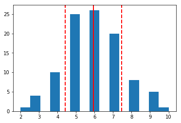
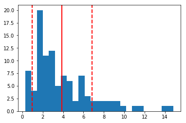
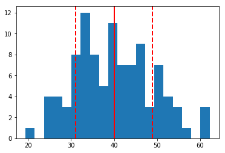
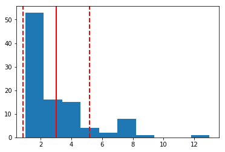
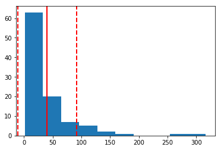
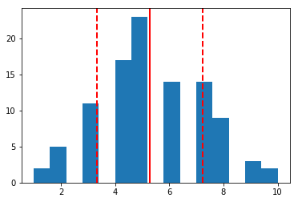
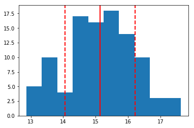

```python
# Ayan Karim DRILL - Descriptive Statistics and Normality
```


```python
import numpy as np
import pandas as pd
import matplotlib.pyplot as plt
%matplotlib inline
```


```python
# 1. Binomial Data Set

n, p = 10, 0.6
binomial = pd.DataFrame(np.random.binomial(10, 0.6, 100))
```


```python
plt.hist(binomial[0], bins=15)
plt.axvline(binomial[0].mean(), color='r', linestyle='solid', linewidth=2)
plt.axvline(binomial[0].mean() + binomial[0].std(), color='r', linestyle='dashed', linewidth=2)
plt.axvline(binomial[0].mean() - binomial[0].std(), color='r', linestyle='dashed', linewidth=2)
print('mean = ' + str(np.mean(binomial[0])))
print('median = ' + str(np.median(binomial[0])))
print('standard deviation = ' + str(np.std(binomial[0], ddof=1)))
```

    mean = 5.94
    median = 6.0
    standard deviation = 1.5230219826371383





```python
# The binomial distribution shows a normal distribution since the mean accurately 
# describes the center of the data where the probability mass is the most populated.
# Furthermore, the standard deviations is relatively large at 1.52 but because the 
# data is normal we can cocnlude 68.2% of the data is within 1 standard deviation of the mean.
```


```python
# 2. Gamma Data Set

shape = 10
scale = 10

gamma = pd.DataFrame(np.random.gamma(2, 2, 100))
```


```python
plt.hist(gamma[0], bins=25)
plt.axvline(gamma[0].mean(), color='r', linestyle='solid', linewidth=2)
plt.axvline(gamma[0].mean() + gamma[0].std(), color='r', linestyle='dashed', linewidth=2)
plt.axvline(gamma[0].mean() - gamma[0].std(), color='r', linestyle='dashed', linewidth=2)
print('mean = ' + str(np.mean(gamma[0])))
print('median = ' + str(np.median(gamma[0])))
print('standard deviation = ' + str(np.std(gamma[0], ddof=1)))
```

    mean = 3.896860919780443
    median = 2.8127104645304266
    standard deviation = 2.942625534220005





```python
# The gamma distribution is positively skewed so the mean is larger than the median.
# Thus neither the mean nor the median give use a good sense of centrality in this data.
# However, the standard deviation still summarises the majority of the data around the mean.
```


```python
# 3. Chi-square distribution

chi_square = np.random.chisquare(40,100)
```


```python
plt.hist(chi_square, bins=20)
plt.axvline(chi_square.mean(), color='r', linestyle='solid', linewidth=2)
plt.axvline(chi_square.mean() + chi_square.std(), color='r', linestyle='dashed', linewidth=2)
plt.axvline(chi_square.mean() - chi_square.std(), color='r', linestyle='dashed', linewidth=2)
print('mean = ' + str(np.mean(chi_square)))
print('median = ' + str(np.median(chi_square)))
print('standard deviation = ' + str(np.std(chi_square, ddof=1)))
```

    mean = 40.01090464379852
    median = 39.46890956163071
    standard deviation = 8.997982629285481





```python
# The chi-squared data shows a normal distribution that isn't completely consistent
# as there are multiple fluctations in low and high peaks. The standard deviation still informs
# us of 68.2% of the data.
```


```python
# 4. Geometric Distribution

geometric = np.random.geometric(p=0.35, size=100)
```


```python
plt.hist(geometric, bins=10)
plt.axvline(geometric.mean(), color='r', linestyle='solid', linewidth=2)
plt.axvline(geometric.mean() + geometric.std(), color='r', linestyle='dashed', linewidth=2)
plt.axvline(geometric.mean() - geometric.std(), color='r', linestyle='dashed', linewidth=2)
print('mean = ' + str(np.mean(geometric)))
print('median = ' + str(np.median(geometric)))
print('standard deviation = ' + str(np.std(geometric, ddof=1)))
```

    mean = 3.0
    median = 2.0
    standard deviation = 2.188122205883115





```python
# The geometric distribution shows a strong positive skew indicating that the mean and
# median are bad measures of center. Once again the standard deviations surround most of the
# data.
```


```python
# 5. Lognormal Distribution

lognormal = np.random.lognormal(3., 1., 100)
```


```python
plt.hist(lognormal)
plt.axvline(lognormal.mean(), color='r', linestyle='solid', linewidth=2)
plt.axvline(lognormal.mean() + lognormal.std(), color='r', linestyle='dashed', linewidth=2)
plt.axvline(lognormal.mean() - lognormal.std(), color='r', linestyle='dashed', linewidth=2)
print('mean = ' + str(np.mean(lognormal)))
print('median = ' + str(np.median(lognormal)))
print('standard deviation = ' + str(np.std(lognormal, ddof=1)))
```

    mean = 40.46606805588365
    median = 22.76133604230909
    standard deviation = 51.18337779893976





```python
# The lognormal distribution shows a strong positive skew indicating that the mean and
# median are bad measures of center. Here the standard deviation to the left of the mean
# go beyond the data so not much can be concluded from it.
```


```python
# 6. Poisson Distribution

poisson = np.random.poisson(5, 100)
```


```python
plt.hist(poisson, bins=15)
plt.axvline(poisson.mean(), color='r', linestyle='solid', linewidth=2)
plt.axvline(poisson.mean() + poisson.std(), color='r', linestyle='dashed', linewidth=2)
plt.axvline(poisson.mean() - poisson.std(), color='r', linestyle='dashed', linewidth=2)
print('mean = ' + str(np.mean(poisson)))
print('median = ' + str(np.median(poisson)))
print('standard deviation = ' + str(np.std(poisson, ddof=1)))
```

    mean = 5.29
    median = 5.0
    standard deviation = 1.9555412074772074





```python
# The poisson data shows a normal distribution so the mean is a good measure of center.
# There are some gaps in the data between the bars, so 1 standard deviation may not be 
# enough to encompass all the data.
```


```python
normal1 = np.random.normal(5, 0.5, 100)
normal2 = np.random.normal(10, 1, 100)
normal3 = normal1 + normal2
plt.hist(normal3)
plt.axvline(normal3.mean(), color='r', linestyle='solid', linewidth=2)
plt.axvline(normal3.mean() + normal3.std(), color='r', linestyle='dashed', linewidth=2)
plt.axvline(normal3.mean() - normal3.std(), color='r', linestyle='dashed', linewidth=2)
print('mean = ' + str(np.mean(normal3)))
print('median = ' + str(np.median(normal3)))
print('standard deviation = ' + str(np.std(normal3, ddof=1)))
```

    mean = 15.136354432933102
    median = 15.20639057723419
    standard deviation = 1.0822961282638688





```python
# There's a slight, but present normal distrubtion in the in the histogram above.
# Two normal distributions with different means and standard deviations seem to 
# increase the traffic or cluster of data that makes the distrubtion more shapeless
# rather than a nice flowing normal distribution. However the mean still shows some centrality
# and most of the data falls within 1 standard deviation
```
