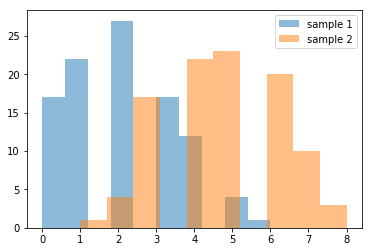
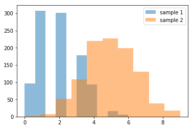
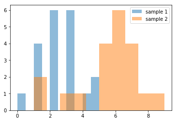
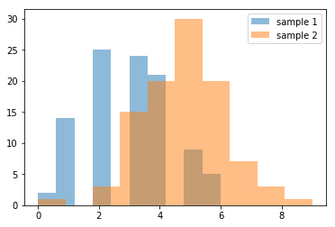
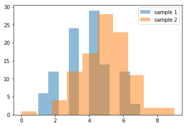
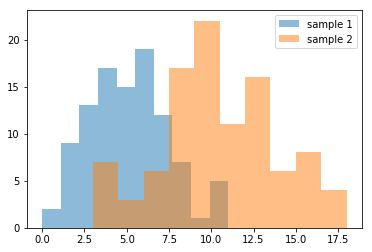

```python
# Ayan Karim DRILL - Exploring the Central Limit Theorem
```


```python
import numpy as np
import pandas as pd
import scipy
import matplotlib.pyplot as plt
%matplotlib inline
```


```python
pop1 = np.random.binomial(10, 0.2, 10000)
pop2 = np.random.binomial(10, 0.5, 10000)
sample1 = np.random.choice(pop1, 100, replace=True)
sample2 = np.random.choice(pop2, 100, replace=True)
print(sample1.mean())
print(sample2.mean())
print(sample1.std())
print(sample2.std())
plt.hist(sample1, alpha=0.5, label='sample 1') 
plt.hist(sample2, alpha=0.5, label='sample 2')
plt.legend(loc='upper right')
```

    2.01
    4.77
    1.4387147041717478
    1.4956938189348783


    <matplotlib.legend.Legend at 0x114861e48>





```python
# 1.

sample1 = np.random.choice(pop1, 1000, replace=True)
sample2 = np.random.choice(pop2, 1000, replace=True)
print(sample1.mean())
print(sample2.mean())
print(sample1.std())
print(sample2.std())
plt.hist(sample1, alpha=0.5, label='sample 1') 
plt.hist(sample2, alpha=0.5, label='sample 2')
plt.legend(loc='upper right')
```

    1.932
    5.018
    1.2121782047207417
    1.6104893666212143


    <matplotlib.legend.Legend at 0x113f41f98>





```python
# What I think will happen: I think the means of both samples will change, 
# sample 1 will have a higher mean and sample 2 will have a lower mean. The standard
# deviations will stay relatively the same.
```


```python
sample1 = np.random.choice(pop1, 20, replace=True)
sample2 = np.random.choice(pop2, 20, replace=True)
print(sample1.mean())
print(sample2.mean())
print(sample1.std())
print(sample2.std())
plt.hist(sample1, alpha=0.5, label='sample 1') 
plt.hist(sample2, alpha=0.5, label='sample 2')
plt.legend(loc='upper right')
```

    2.4
    5.5
    1.2806248474865698
    1.9874606914351791


    <matplotlib.legend.Legend at 0x113b34278>





```python
# 2.
pop1 = np.random.binomial(10, 0.3, 10000)
pop2 = np.random.binomial(10, 0.5, 10000)
sample1 = np.random.choice(pop1, 100, replace=True)
sample2 = np.random.choice(pop2, 100, replace=True)
print(sample1.mean())
print(sample2.mean())
print(sample1.std())
print(sample2.std())
plt.hist(sample1, alpha=0.5, label='sample 1') 
plt.hist(sample2, alpha=0.5, label='sample 2')
plt.legend(loc='upper right')
from scipy.stats import ttest_ind
print(ttest_ind(sample2, sample1, equal_var=False))
```

    2.95
    4.83
    1.4168627315304754
    1.483610461003831
    Ttest_indResult(statistic=9.118147664531472, pvalue=8.792838812604047e-17)





```python
from scipy.stats import ttest_ind
print(ttest_ind(sample2, sample1, equal_var=False))
```

    Ttest_indResult(statistic=10.29934866505355, pvalue=3.74909249246463e-20)


```python
# What I think will happen: I think the t-value and the p-value will decrease.
```


```python
pop1 = np.random.binomial(10, 0.4, 10000)
pop2 = np.random.binomial(10, 0.5, 10000)
sample1 = np.random.choice(pop1, 100, replace=True)
sample2 = np.random.choice(pop2, 100, replace=True)
print(sample1.mean())
print(sample2.mean())
print(sample1.std())
print(sample2.std())
plt.hist(sample1, alpha=0.5, label='sample 1') 
plt.hist(sample2, alpha=0.5, label='sample 2')
plt.legend(loc='upper right')
from scipy.stats import ttest_ind
print(ttest_ind(sample2, sample1, equal_var=False))
```

    3.81
    5.01
    1.453925720248459
    1.5588136514670379
    Ttest_indResult(statistic=5.601305237336355, pvalue=7.086290410111413e-08)





```python
# The t-value did decrease a lot, but the pvalue actually increased.
```


```python
# 3.

pop1 = np.random.poisson(5, 10000)
pop2 = np.random.poisson(10, 10000)
sample1 = np.random.choice(pop1, 100, replace=True)
sample2 = np.random.choice(pop2, 100, replace=True)
print(sample1.mean())
print(sample2.mean())
print(sample1.std())
print(sample2.std())
plt.hist(sample1, alpha=0.5, label='sample 1') 
plt.hist(sample2, alpha=0.5, label='sample 2')
plt.legend(loc='upper right')
from scipy.stats import ttest_ind
print(ttest_ind(sample2, sample1, equal_var=False))
```

    5.14
    10.22
    2.190981515211847
    3.389926252885157
    Ttest_indResult(statistic=12.522588478223756, pvalue=6.878739814633878e-26)





```python
# Yes, the samples means accurately represent the population values
# because the pvalue is very low, so differences in the sample means are
# unlikely caused by noise and more likely caused by actual differences in the population.
```
